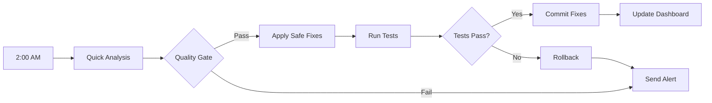
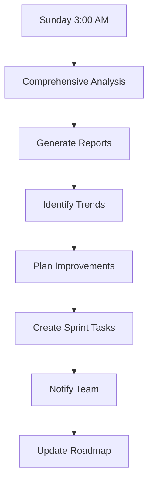
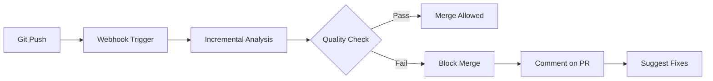

# Continuous Quality Workflow

This command establishes an automated continuous quality improvement system that monitors code health, applies safe fixes, and maintains high standards without manual intervention.

## Usage Examples

```bash
# Set up daily quality checks with safe auto-fixes
/continuous-quality . --schedule=daily --auto-fix=safe

# Weekly comprehensive analysis with notifications
/continuous-quality . --schedule=weekly --notify=slack

# Commit-triggered quality gates
/continuous-quality . --schedule=commit --auto-fix=none --notify=github
```

## Continuous Quality System

### Component 1: Quality Monitor

```yaml
# .quality/monitor-config.yml
monitoring:
  schedule:
    daily:
      time: "02:00"
      checks:
        - quick-analysis
        - security-scan
        - dependency-audit
    
    weekly:
      day: "sunday"
      time: "03:00"
      checks:
        - deep-analysis
        - performance-profile
        - architecture-review
    
    on-commit:
      branches: ["main", "develop"]
      checks:
        - incremental-analysis
        - test-coverage
        - lint-check

  thresholds:
    health_score:
      minimum: 75
      target: 85
      alert_below: 70
    
    security_score:
      minimum: 90
      target: 95
      alert_below: 85
    
    test_coverage:
      minimum: 70
      target: 80
      alert_below: 65

  auto_fix:
    enabled: true
    mode: "safe"  # safe | aggressive | none
    categories:
      - security_critical
      - quick_wins
      - lint_errors
    
    require_approval:
      - breaking_changes
      - large_refactors
      - dependency_updates
```

### Component 2: Analysis Pipeline

```bash
#!/bin/bash
# .quality/analyze.sh

set -euo pipefail

QUALITY_DIR=".quality"
REPORTS_DIR="$QUALITY_DIR/reports"
TIMESTAMP=$(date +%Y%m%d-%H%M%S)

echo "🔍 Starting Continuous Quality Analysis..."

# Phase 1: Analysis
case "$1" in
  "quick")
    /analyze-deep . --quick --export-json=$REPORTS_DIR/quick-$TIMESTAMP.json
    ;;
  "deep")
    /analyze-deep . --comprehensive --export-all --export-dir=$REPORTS_DIR/deep-$TIMESTAMP
    ;;
  "incremental")
    LAST_COMMIT=$(git rev-parse HEAD~1)
    /analyze-deep . --since=$LAST_COMMIT --export-json=$REPORTS_DIR/incremental-$TIMESTAMP.json
    ;;
esac

# Phase 2: Quality Gates
/analyze-report $REPORTS_DIR/*-$TIMESTAMP.json --check-thresholds

# Phase 3: Auto-Fix (if enabled)
if [[ "$AUTO_FIX" == "true" ]]; then
  /fix-quick-wins $REPORTS_DIR/*-$TIMESTAMP.json --dry-run > $REPORTS_DIR/fix-plan-$TIMESTAMP.md
  
  if [[ "$AUTO_FIX_MODE" == "safe" ]]; then
    /fix-quick-wins $REPORTS_DIR/*-$TIMESTAMP.json --category=security_critical,lint_errors
  elif [[ "$AUTO_FIX_MODE" == "aggressive" ]]; then
    /fix-quick-wins $REPORTS_DIR/*-$TIMESTAMP.json --min-roi=3
  fi
fi

# Phase 4: Reporting
/generate-quality-report $REPORTS_DIR/*-$TIMESTAMP.json --format=dashboard
```

### Component 3: Auto-Fix System

```javascript
// .quality/auto-fix-rules.js
export const autoFixRules = {
  security_critical: {
    sql_injection: {
      confidence: 0.95,
      autoApprove: true,
      pattern: /query\s*\(\s*['"`].*\$\{.*\}/,
      fix: (code) => {
        // Convert to parameterized query
        return code.replace(/query\(['"`](.*)\$\{(\w+)\}(.*)['"]\)/, 
          "query('$1?$3', [$2])");
      }
    },
    
    xss_prevention: {
      confidence: 0.90,
      autoApprove: true,
      pattern: /innerHTML\s*=\s*[^'"`]*(user|input|data)/,
      fix: (code) => {
        return code.replace(/innerHTML\s*=\s*(.*)/, 'textContent = $1');
      }
    }
  },
  
  quick_wins: {
    unused_imports: {
      confidence: 0.98,
      autoApprove: true,
      fix: async (file) => {
        const analysis = await analyzeImports(file);
        return removeUnusedImports(file, analysis.unused);
      }
    },
    
    console_logs: {
      confidence: 1.0,
      autoApprove: false,
      pattern: /console\.(log|debug|info)/,
      fix: (code) => {
        // Remove or replace with proper logging
        return code.replace(/console\.(log|debug|info)\(.*\);?\n?/g, '');
      }
    }
  }
};
```

### Component 4: Quality Dashboard

```html
<!-- .quality/dashboard/index.html -->
<!DOCTYPE html>
<html>
<head>
  <title>Code Quality Dashboard</title>
  <link rel="stylesheet" href="dashboard.css">
</head>
<body>
  <div class="dashboard">
    <header>
      <h1>Continuous Quality Dashboard</h1>
      <div class="last-updated">Last updated: <span id="timestamp"></span></div>
    </header>
    
    <section class="metrics">
      <div class="metric-card health">
        <h3>Health Score</h3>
        <div class="score">82</div>
        <div class="trend up">+3</div>
        <canvas id="health-chart"></canvas>
      </div>
      
      <div class="metric-card security">
        <h3>Security Score</h3>
        <div class="score">94</div>
        <div class="trend up">+2</div>
        <canvas id="security-chart"></canvas>
      </div>
      
      <div class="metric-card coverage">
        <h3>Test Coverage</h3>
        <div class="score">76%</div>
        <div class="trend up">+4%</div>
        <canvas id="coverage-chart"></canvas>
      </div>
    </section>
    
    <section class="recent-fixes">
      <h2>Recent Auto-Fixes</h2>
      <table>
        <thead>
          <tr>
            <th>Timestamp</th>
            <th>Type</th>
            <th>Description</th>
            <th>Status</th>
          </tr>
        </thead>
        <tbody id="fixes-table">
          <!-- Populated by JavaScript -->
        </tbody>
      </table>
    </section>
    
    <section class="alerts">
      <h2>Active Alerts</h2>
      <div id="alerts-container">
        <!-- Populated by JavaScript -->
      </div>
    </section>
  </div>
  
  <script src="dashboard.js"></script>
</body>
</html>
```

### Component 5: Notification System

```javascript
// .quality/notifications.js
class QualityNotifier {
  async notify(report, config) {
    const summary = this.generateSummary(report);
    
    if (config.notify.includes('slack')) {
      await this.notifySlack(summary);
    }
    
    if (config.notify.includes('email')) {
      await this.notifyEmail(summary);
    }
    
    if (config.notify.includes('github')) {
      await this.notifyGitHub(summary);
    }
  }
  
  generateSummary(report) {
    return {
      title: `Quality Report: ${report.status}`,
      health: report.health_score,
      issues: {
        critical: report.critical_count,
        high: report.high_count,
        medium: report.medium_count
      },
      fixes: report.auto_fixes_applied,
      trend: report.trend
    };
  }
  
  async notifySlack(summary) {
    const webhook = process.env.SLACK_WEBHOOK;
    const color = summary.health > 80 ? 'good' : 
                  summary.health > 60 ? 'warning' : 'danger';
    
    await fetch(webhook, {
      method: 'POST',
      body: JSON.stringify({
        attachments: [{
          color,
          title: summary.title,
          fields: [
            { title: 'Health Score', value: summary.health, short: true },
            { title: 'Critical Issues', value: summary.issues.critical, short: true },
            { title: 'Auto-Fixes Applied', value: summary.fixes, short: true },
            { title: 'Trend', value: summary.trend, short: true }
          ]
        }]
      })
    });
  }
}
```

## Continuous Improvement Workflows

### Daily Workflow


### Weekly Deep Analysis


### Commit-Triggered Checks


## Setup Instructions

### 1. Initial Setup
```bash
# Initialize continuous quality
/continuous-quality . --init

# This creates:
# - .quality/ directory
# - Configuration files
# - Git hooks
# - CI/CD templates
```

### 2. Configure Schedule
```bash
# Set up cron jobs
crontab -e

# Add daily quality check
0 2 * * * cd /path/to/project && .quality/run-daily.sh

# Add weekly deep analysis
0 3 * * 0 cd /path/to/project && .quality/run-weekly.sh
```

### 3. CI/CD Integration
```yaml
# .github/workflows/continuous-quality.yml
name: Continuous Quality

on:
  push:
    branches: [main, develop]
  schedule:
    - cron: '0 2 * * *'

jobs:
  quality-check:
    runs-on: ubuntu-latest
    steps:
      - uses: actions/checkout@v2
      
      - name: Run Quality Analysis
        run: |
          .quality/analyze.sh incremental
      
      - name: Apply Auto-Fixes
        if: github.event_name == 'schedule'
        run: |
          .quality/auto-fix.sh
      
      - name: Update Dashboard
        run: |
          .quality/update-dashboard.sh
      
      - name: Deploy Dashboard
        uses: peaceiris/actions-gh-pages@v3
        with:
          github_token: ${{ secrets.GITHUB_TOKEN }}
          publish_dir: .quality/dashboard
```

## Monitoring & Alerts

### Alert Rules
```yaml
alerts:
  quality_degradation:
    condition: "health_score < previous_health_score - 5"
    severity: "warning"
    action: "notify_team"
  
  security_critical:
    condition: "security_issues.critical > 0"
    severity: "critical"
    action: "block_deploy"
  
  coverage_drop:
    condition: "test_coverage < previous_coverage - 3"
    severity: "warning"
    action: "notify_qa"
  
  performance_regression:
    condition: "performance_score < 70"
    severity: "high"
    action: "run_profiler"
```

### Metrics Tracking
- Health score trends
- Fix success rate
- Time to resolution
- False positive rate
- Team velocity impact

## Best Practices

1. **Start Conservative**: Begin with safe auto-fixes only
2. **Monitor False Positives**: Adjust rules based on accuracy
3. **Gradual Automation**: Increase auto-fix scope over time
4. **Team Buy-In**: Involve team in threshold setting
5. **Regular Reviews**: Monthly review of rules and thresholds

This workflow ensures consistent code quality through automation while maintaining team control and visibility.