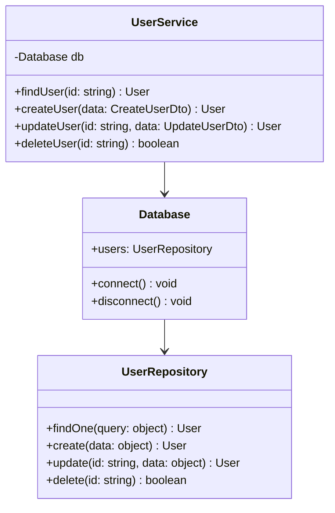

# Generate Documentation Command

This command automatically generates comprehensive documentation for your codebase, including API documentation, README files, inline comments, and architecture diagrams. It analyzes code structure and creates clear, maintainable documentation.

## Usage Examples

```bash
# Generate all documentation types
/generate-documentation src/

# Generate only API documentation
/generate-documentation src/ --types=api

# Update existing documentation
/generate-documentation . --update-existing

# Generate with diagrams
/generate-documentation src/ --types=api,diagrams --format=markdown
```

## Documentation Types

### 1. API Documentation

```typescript
// Source code
export class UserService {
  constructor(private db: Database) {}

  async findUser(id: string): Promise<User | null> {
    return this.db.users.findOne({ id });
  }

  async createUser(data: CreateUserDto): Promise<User> {
    const user = await this.db.users.create(data);
    await this.sendWelcomeEmail(user);
    return user;
  }
}

// Generated documentation
/**
 * Service for managing user operations
 * @class UserService
 * @description Handles user CRUD operations and related business logic
 */
export class UserService {
  /**
   * Creates a new UserService instance
   * @param {Database} db - Database connection instance
   */
  constructor(private db: Database) {}

  /**
   * Finds a user by their ID
   * @async
   * @param {string} id - The unique identifier of the user
   * @returns {Promise<User|null>} The user object if found, null otherwise
   * @throws {DatabaseError} If database connection fails
   * @example
   * const user = await userService.findUser('123');
   * if (user) {
   *   console.log(user.name);
   * }
   */
  async findUser(id: string): Promise<User | null> {
    return this.db.users.findOne({ id });
  }

  /**
   * Creates a new user in the system
   * @async
   * @param {CreateUserDto} data - User creation data
   * @param {string} data.email - User's email address
   * @param {string} data.name - User's full name
   * @param {string} [data.role='user'] - User's role (optional)
   * @returns {Promise<User>} The created user object
   * @throws {ValidationError} If data validation fails
   * @throws {DuplicateError} If email already exists
   * @example
   * const newUser = await userService.createUser({
   *   email: 'user@example.com',
   *   name: 'John Doe'
   * });
   */
  async createUser(data: CreateUserDto): Promise<User> {
    const user = await this.db.users.create(data);
    await this.sendWelcomeEmail(user);
    return user;
  }
}
```

### 2. README Generation

```markdown
# User Service Module

## Overview
The User Service module provides comprehensive user management functionality including CRUD operations, authentication, and user-related business logic.

## Installation
```bash
npm install @myapp/user-service
```

## Usage

### Basic Example
```javascript
import { UserService } from '@myapp/user-service';
import { Database } from '@myapp/database';

const db = new Database();
const userService = new UserService(db);

// Find a user
const user = await userService.findUser('123');

// Create a user
const newUser = await userService.createUser({
  email: 'user@example.com',
  name: 'John Doe'
});
```

## API Reference

### UserService

#### Constructor
- `new UserService(db: Database)`

#### Methods

##### findUser(id: string): Promise<User | null>
Finds a user by their ID.

**Parameters:**
- `id` (string): The unique identifier of the user

**Returns:**
- `Promise<User | null>`: The user object if found, null otherwise

##### createUser(data: CreateUserDto): Promise<User>
Creates a new user in the system.

**Parameters:**
- `data` (CreateUserDto): User creation data
  - `email` (string): User's email address
  - `name` (string): User's full name
  - `role` (string, optional): User's role (default: 'user')

**Returns:**
- `Promise<User>`: The created user object

## Error Handling

The service may throw the following errors:
- `ValidationError`: When input data is invalid
- `DuplicateError`: When attempting to create a user with existing email
- `DatabaseError`: When database operations fail

## Testing

```bash
npm test -- user-service
```

## Contributing
Please read CONTRIBUTING.md for details on our code of conduct and the process for submitting pull requests.

## License
This module is part of MyApp and is proprietary software.
```

### 3. Architecture Diagrams

```mermaid
# Generated: architecture.md

## System Architecture

```mermaid
graph TB
    subgraph "Frontend"
        UI[UI Components]
        State[State Management]
    end
    
    subgraph "API Layer"
        REST[REST API]
        GraphQL[GraphQL API]
        Auth[Auth Middleware]
    end
    
    subgraph "Service Layer"
        UserSvc[User Service]
        ProductSvc[Product Service]
        OrderSvc[Order Service]
    end
    
    subgraph "Data Layer"
        DB[(PostgreSQL)]
        Redis[(Redis Cache)]
        S3[S3 Storage]
    end
    
    UI --> REST
    UI --> GraphQL
    REST --> Auth
    GraphQL --> Auth
    Auth --> UserSvc
    REST --> ProductSvc
    REST --> OrderSvc
    UserSvc --> DB
    UserSvc --> Redis
    ProductSvc --> DB
    ProductSvc --> S3
    OrderSvc --> DB
```

## Component Relationships



### 4. Inline Comments

```javascript
// Before
function calculatePrice(items, discount, tax) {
  const subtotal = items.reduce((sum, item) => sum + item.price * item.quantity, 0);
  const discountAmount = subtotal * discount;
  const discountedPrice = subtotal - discountAmount;
  const taxAmount = discountedPrice * tax;
  return discountedPrice + taxAmount;
}

// After
/**
 * Calculates the final price including discounts and taxes
 * @param {Array<{price: number, quantity: number}>} items - Array of items with price and quantity
 * @param {number} discount - Discount percentage as decimal (e.g., 0.1 for 10%)
 * @param {number} tax - Tax percentage as decimal (e.g., 0.08 for 8%)
 * @returns {number} Final price after discount and tax
 */
function calculatePrice(items, discount, tax) {
  // Calculate base price by summing all items
  const subtotal = items.reduce((sum, item) => sum + item.price * item.quantity, 0);
  
  // Apply discount to subtotal
  const discountAmount = subtotal * discount;
  const discountedPrice = subtotal - discountAmount;
  
  // Calculate and add tax on discounted price
  const taxAmount = discountedPrice * tax;
  return discountedPrice + taxAmount;
}
```

## Workflow

### Phase 1: Analysis

1. **Code Structure Analysis**:
   - Parse source files
   - Build dependency graph
   - Identify public APIs
   - Extract type information

2. **Documentation Detection**:
   - Find existing docs
   - Identify gaps
   - Check outdated docs
   - Plan updates

### Phase 2: Generation Strategy

1. **API Documentation**:
   - Extract function signatures
   - Infer parameter types
   - Generate examples
   - Add error documentation

2. **README Structure**:
   - Project overview
   - Installation steps
   - Usage examples
   - API reference
   - Contributing guide

3. **Diagram Generation**:
   - System architecture
   - Component relationships
   - Data flow
   - Sequence diagrams

### Phase 3: Content Generation

1. **Smart Inference**:
   - Analyze function names
   - Understand patterns
   - Extract business logic
   - Generate descriptions

2. **Example Creation**:
   ```javascript
   // Analyze test files for examples
   // Extract common usage patterns
   // Generate realistic examples
   ```

3. **Cross-Referencing**:
   - Link related functions
   - Reference types
   - Connect modules

### Phase 4: Formatting

1. **Markdown Generation**:
   - Proper headings
   - Code blocks
   - Tables for parameters
   - Navigation links

2. **HTML Generation**:
   - Interactive docs
   - Search functionality
   - Syntax highlighting
   - Responsive design

### Phase 5: Integration

```bash
# Update package.json
{
  "scripts": {
    "docs": "typedoc --out docs src",
    "docs:serve": "http-server docs"
  }
}
```

## Documentation Patterns

### Function Documentation
```javascript
/**
 * Brief description of what the function does
 * 
 * @description Detailed explanation including business logic,
 * side effects, and important notes
 * 
 * @param {Type} paramName - Parameter description
 * @param {Object} options - Configuration object
 * @param {boolean} [options.flag=false] - Optional flag
 * 
 * @returns {ReturnType} Description of return value
 * 
 * @throws {ErrorType} When this error occurs
 * 
 * @example
 * // Example usage
 * const result = functionName(param, { flag: true });
 * 
 * @see {@link RelatedFunction} For related functionality
 * @since 1.2.0
 * @deprecated Use {@link NewFunction} instead
 */
```

### Class Documentation
```javascript
/**
 * @class ClassName
 * @classdesc Comprehensive description of the class purpose
 * @implements {Interface}
 * @extends {BaseClass}
 * 
 * @example
 * const instance = new ClassName(options);
 * instance.method();
 */
```

### Module Documentation
```javascript
/**
 * @module moduleName
 * @description Module overview and purpose
 * 
 * @requires module:otherModule
 * @exports {Function} functionName
 * @exports {Class} ClassName
 */
```

## Output Examples

### Generated API Docs Structure
```
docs/
├── index.html
├── api/
│   ├── classes/
│   │   ├── UserService.html
│   │   └── ProductService.html
│   ├── interfaces/
│   │   ├── User.html
│   │   └── Product.html
│   └── modules/
│       ├── auth.html
│       └── utils.html
├── guides/
│   ├── getting-started.html
│   └── advanced-usage.html
└── assets/
    ├── style.css
    └── search.js
```

## Configuration

Default settings:
- Types: api, readme, comments
- Format: markdown
- Update existing: true
- Include private: false
- Include examples: true

## Best Practices

1. **Keep Updated**:
   - Run after significant changes
   - Include in CI/CD
   - Version documentation

2. **Be Descriptive**:
   - Explain "why" not just "what"
   - Include examples
   - Document edge cases

3. **Maintain Consistency**:
   - Use standard format
   - Follow conventions
   - Regular reviews

This command helps maintain comprehensive, up-to-date documentation that improves code maintainability and team productivity.