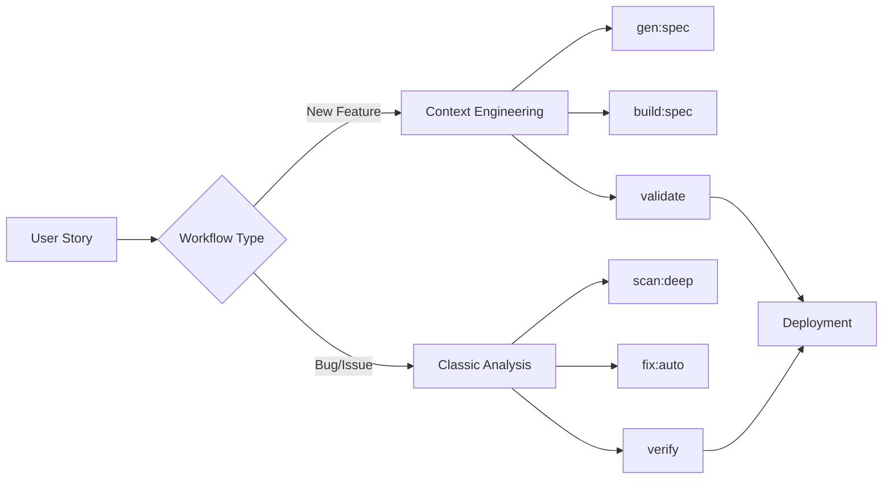

# Context Engineering Integration Plan für Claude Code Toolkit

## Executive Summary

Dieses Dokument beschreibt die Integration von Context Engineering Prinzipien in das Claude Code Toolkit. Context Engineering erweitert das bestehende reaktive Analyse-und-Fix-Paradigma um einen proaktiven, requirements-getriebenen Entwicklungsansatz, der strukturierte Feature-Entwicklung mit umfassendem Kontext ermöglicht.

## 1. Motivation und Zielsetzung

### 1.1 Warum Context Engineering?

**Problem**: Aktuelle KI-Coding-Assistenten leiden unter:

- **Kontext-Verlust**: Bei längeren Entwicklungssessions geht wichtiger Kontext verloren
- **Inkonsistente Outputs**: Ohne strukturierte Requirements entstehen inkonsistente Lösungen
- **Fehlende Proaktivität**: Fokus liegt auf Problem-Fixing statt Feature-Development
- **Fragmentierte Workflows**: Keine durchgängige Pipeline von Requirements zu Code

**Lösung durch Context Engineering**:

- **Strukturierte Specifications** (Specs) als Single Source of Truth
- **Persistenter Kontext** durch Knowledge Base und RAG
- **Proaktive Entwicklung** mit klaren Implementierungsschritten
- **End-to-End Workflows** von der Idee bis zur Produktion

### 1.2 Synergien mit Claude Code Toolkit

Unser Toolkit bietet bereits eine exzellente Grundlage:

| Vorhandene Stärke    | Context Engineering Erweiterung | Synergie                            |
| -------------------- | ------------------------------- | ----------------------------------- |
| Sub-Agent System     | Spec-spezialisierte Agents      | Strukturierte Feature-Entwicklung   |
| Command Chains       | Feature-Development Pipelines   | Requirements-zu-Code Automation     |
| Analyse-Fokus        | Proaktive Entwicklung           | Vollständiger Development Lifecycle |
| Export/Report System | Spec Generation & Tracking      | Dokumentierte Feature-Evolution     |

## 2. Architektur-Übersicht

### 2.1 Drei-Säulen-Modell

```
┌─────────────────────────────────────────────────────────┐
│                  Context Engineering Layer               │
├───────────────────┬────────────────┬────────────────────┤
│   Spec System     │  Knowledge Base │  Context Manager  │
│                   │                 │                   │
│ • Requirements    │ • Frameworks    │ • Feature Context │
│ • Specifications  │ • Patterns      │ • Session State   │
│ • Validation      │ • Standards     │ • History         │
└───────────────────┴────────────────┴────────────────────┘
                            ⬇️
┌─────────────────────────────────────────────────────────┐
│              Existing Claude Code Toolkit                │
├───────────────────┬────────────────┬────────────────────┤
│   Commands        │    Agents       │    Pipelines      │
│                   │                 │                   │
│ • scan/*          │ • architect     │ • deep-quality    │
│ • fix/*           │ • security      │ • refactoring     │
│ • gen/*           │ • performance   │ • release-prep    │
└───────────────────┴────────────────┴────────────────────┘
```

### 2.2 Datenfluss

```
Requirements (INITIAL.md)
    ⬇️
[/gen:spec] → Spec Generation
    ⬇️
Specification (feature.spec.md)
    ⬇️
[/build:spec] → Implementation
    ⬇️ (parallel)
    ├─→ Code Generation
    ├─→ Test Creation
    └─→ Documentation
    ⬇️
[/scan:quality] → Validation
    ⬇️
[/meta:export] → Deliverables
```

## 3. Implementierungsplan

### Phase 1: Spec-System (Week 1)

#### 3.1.1 Spec Template Struktur

**Warum**: Templates gewährleisten konsistente, vollständige Specifications.

**Was**: Erstelle strukturierte Templates für verschiedene Feature-Typen:

```
specs/templates/
├── feature.spec.md          # Generisches Feature-Template
├── api.spec.md              # REST/GraphQL API Template
├── component.spec.md        # Frontend Component Template
├── data-model.spec.md       # Datenbank/Model Template
├── integration.spec.md      # System-Integration Template
└── bugfix.spec.md           # Bugfix mit Root-Cause Template
```

**Wie**: Jedes Template enthält:

- Strukturierte Sections (Requirements, Specs, Implementation Steps)
- Validierungs-Checklisten
- Code-Beispiele und Anti-Patterns
- Test-Szenarien
- Rollout-Strategien

#### 3.1.2 Spec Generation Command

**Datei**: `commands/gen/spec.md`

````markdown
---
description: Generate comprehensive specification from initial requirements
argument-hint: <requirements-file> [--template=<type>] [--knowledge-base] [--examples]
---

# Generate Specification

Transform high-level requirements into detailed, actionable specifications.

## Workflow

1. **Analyze Requirements**

   - Parse INITIAL.md or user input
   - Identify feature type and complexity
   - Extract functional/non-functional requirements

2. **Knowledge Retrieval**

   - Search knowledge base for relevant patterns
   - Find similar implementations in codebase
   - Gather framework best practices

3. **Spec Construction**

   - Select appropriate template
   - Fill sections with specific details
   - Add validation criteria
   - Include code examples

4. **Validation**
   - Check completeness
   - Verify technical feasibility
   - Ensure testability

## Usage

```bash
# Basic generation
/prefix:gen:spec requirements.md

# With specific template
/prefix:gen:spec requirements.md --template=api

# With knowledge base integration
/prefix:gen:spec requirements.md --knowledge-base --examples
```
````

````

#### 3.1.3 Spec Build Command

**Datei**: `commands/build/spec.md`

```markdown
---
description: Build implementation from specification with validation checkpoints
argument-hint: <spec-file> [--validate-each-step] [--dry-run] [--parallel]
---

# Build from Specification

Implement features based on comprehensive specifications with built-in validation.

## Execution Strategy

1. **Pre-flight Check**
   - Validate spec completeness
   - Check dependencies
   - Ensure environment readiness

2. **Phased Implementation**
   - Foundation (structure, dependencies)
   - Core Features (main functionality)
   - Integration (system connections)
   - Polish (optimization, documentation)

3. **Continuous Validation**
   - After each phase
   - Against acceptance criteria
   - With automated tests

4. **Deliverable Generation**
   - Code artifacts
   - Test suites
   - Documentation
   - Deployment configs
````

### Phase 2: Knowledge Base Integration (Week 2)

#### 3.2.1 Knowledge Structure

**Warum**: Persistenter Kontext für konsistente Entwicklung.

**Was**: Hierarchische Knowledge Base:

```
knowledge/
├── frameworks/
│   ├── react/
│   │   ├── hooks-patterns.md
│   │   ├── performance-tips.md
│   │   └── testing-strategies.md
│   ├── nodejs/
│   │   ├── async-patterns.md
│   │   ├── error-handling.md
│   │   └── stream-processing.md
│   └── typescript/
│       ├── advanced-types.md
│       ├── generics-guide.md
│       └── configuration.md
├── patterns/
│   ├── design-patterns/
│   │   ├── singleton.md
│   │   ├── factory.md
│   │   └── observer.md
│   ├── architectural/
│   │   ├── clean-architecture.md
│   │   ├── hexagonal.md
│   │   └── microservices.md
│   └── testing/
│       ├── unit-testing.md
│       ├── integration-testing.md
│       └── e2e-testing.md
├── standards/
│   ├── coding-conventions.md
│   ├── security-guidelines.md
│   ├── performance-benchmarks.md
│   └── accessibility-requirements.md
└── examples/
    ├── api-implementations/
    ├── ui-components/
    └── data-models/
```

#### 3.2.2 RAG Integration via MCP

**Warum**: Dynamisches Context-Loading basierend auf aktuellem Task.

**Was**: MCP Server Konfiguration erweitern:

```json
{
  "mcpServers": {
    "knowledge-base": {
      "command": "npx",
      "args": ["-y", "@modelcontextprotocol/server-filesystem", "./knowledge"],
      "env": {}
    },
    "context-memory": {
      "command": "npx",
      "args": ["-y", "@modelcontextprotocol/server-memory"],
      "env": {}
    },
    "pattern-search": {
      "command": "npx",
      "args": ["-y", "@modelcontextprotocol/server-elasticsearch"],
      "env": {
        "ELASTIC_URL": "${ELASTIC_URL}",
        "ELASTIC_API_KEY": "${ELASTIC_API_KEY}"
      }
    }
  }
}
```

**Wie**:

1. Filesystem server für statische Knowledge Base
2. Memory server für Session-Context
3. Optional: Elasticsearch für erweiterte Suche

### Phase 3: Context-Aware Agents (Week 3)

#### 3.3.1 Neue Spezialisierte Agents

**requirements-analyst.md**

```markdown
---
agent-type: "requirements-analyst"
when-to-use: "For analyzing and structuring user requirements"
knowledge-domains:
  ["requirements-engineering", "user-stories", "acceptance-criteria"]
---

You are a Requirements Engineering specialist who:

- Transforms vague requirements into structured specifications
- Identifies hidden requirements and edge cases
- Creates comprehensive acceptance criteria
- Maps requirements to implementation tasks
```

**spec-generator.md**

```markdown
---
agent-type: "spec-generator"
when-to-use: "For creating comprehensive specifications from requirements"
knowledge-domains:
  ["software-architecture", "design-patterns", "best-practices"]
---

You are a Specification specialist who:

- Creates detailed, actionable specs from requirements
- Incorporates relevant patterns and best practices
- Ensures technical feasibility and completeness
- Includes validation and rollout strategies
```

**spec-builder.md**

```markdown
---
agent-type: "spec-builder"
when-to-use: "For implementing features from specifications"
knowledge-domains: ["implementation-patterns", "testing", "documentation"]
---

You are a Specification Implementation specialist who:

- Builds from specs with precision and validation
- Follows TDD/BDD approaches
- Creates comprehensive documentation
- Ensures production readiness
```

#### 3.3.2 Agent Orchestration Patterns

**Sequential Pattern** (Requirements → Spec → Implementation):

```bash
/prefix:flow:feature "requirements.md" \
  --agents="requirements-analyst,spec-generator,spec-builder" \
  --validate-each-step
```

**Parallel Pattern** (Multi-aspect Analysis):

```bash
/prefix:flow:analyze-spec "feature.spec.md" \
  --parallel-agents="security-specialist,performance-optimizer,test-engineer" \
  --merge-recommendations
```

### Phase 4: Feature Development Pipelines (Week 4)

#### 4.4.1 Vordefinierte Pipelines

**feature-development Pipeline**:

```bash
/prefix:meta:chain feature-development
# Führt aus:
# 1. gen:spec requirements.md --template=auto-detect
# 2. flow:review {output} --focus=feasibility
# 3. build:spec {output} --validate-each-step
# 4. scan:quality . --compare=before
# 5. gen:docs --from-spec={output.1}
```

**api-development Pipeline**:

```bash
/prefix:meta:chain api-development
# Führt aus:
# 1. gen:spec requirements.md --template=api
# 2. gen:tests {output} --type=contract
# 3. build:spec {output.1} --tdd
# 4. gen:docs --openapi
# 5. sec:audit . --focus=api
```

#### 4.4.2 Pipeline Konfiguration

Erweiterung von `commands/meta/chain.md`:

````markdown
### 🎯 feature-development

**Purpose**: Complete feature development from requirements to production

```bash
/prefix:meta:chain feature-development
# Executes:
# - gen:spec $ARGUMENTS --template=auto
# - flow:review {output} --aspects=feasibility,security,performance
# - build:spec {output} --validate
# - scan:quality . --full
# - meta:export --deliverables
```
````

### 🔧 api-development

**Purpose**: API endpoint development with contract-first approach

```bash
/prefix:meta:chain api-development
# Executes:
# - gen:spec $ARGUMENTS --template=api
# - gen:tests {output} --contract-first
# - build:spec {output.1} --tdd
# - gen:docs --openapi
# - sec:audit --api-security
```

````

## 4. Integration mit bestehenden Workflows

### 4.1 Hybrid-Ansatz: Analyse + Development



### 4.2 Migration bestehender Commands

Bestehende Commands werden NICHT ersetzt, sondern ergänzt:

| Bestehend     | Neu                                 | Verwendung                     |
| ------------- | ----------------------------------- | ------------------------------ |
| `/scan:*`     | `/gen:spec`                         | Analyse → Requirements         |
| `/fix:*`      | `/build:spec`                       | Fixes → Feature Implementation |
| `/gen:docs`   | erweitertes `/gen:docs --from-spec` | Doku aus Spec                  |
| `/meta:chain` | neue Pipelines                      | Feature-Development Chains     |

### 4.3 Backward Compatibility

- Alle bestehenden Commands bleiben unverändert
- Neue Commands folgen bestehenden Namenskonventionen
- Context Engineering ist opt-in, nicht mandatory

## 5. Implementierungs-Roadmap

### Milestone 1: MVP (Week 1)

- [ ] Spec Templates (3 Basis-Templates)
- [ ] `/gen:spec` Command  
- [ ] `/build:spec` Command
- [ ] `/validate:spec` Command (Spec Validierung)
- [ ] Basis-Pipeline `spec-to-code`

### Milestone 2: Knowledge Integration (Week 2)

- [ ] Knowledge Base Struktur
- [ ] MCP Server Setup
- [ ] RAG Integration in Commands
- [ ] Beispiel-Content für Knowledge Base

### Milestone 3: Agent Enhancement (Week 3)

- [ ] Requirements-Analyst Agent
- [ ] Spec-Generator Agent
- [ ] Spec-Builder Agent
- [ ] Spec-Validator Agent
- [ ] Agent Orchestration Patterns

### Milestone 4: Production Ready (Week 4)

- [ ] Vollständige Pipeline-Suite
- [ ] Dokumentation
- [ ] Test Coverage
- [ ] Performance Optimierung

## 6. Erfolgsmetriken

### Quantitative Metriken

- **Development Speed**: 50% schnellere Feature-Entwicklung
- **Code Quality**: 30% weniger Bugs in neuen Features
- **Consistency**: 80% Code-Stil-Konformität ohne manuelle Reviews
- **Documentation**: 100% automatische Doku-Generation

### Qualitative Metriken

- **Developer Experience**: Reduzierte kognitive Last
- **Requirement Clarity**: Eindeutige Spezifikationen
- **Knowledge Retention**: Wiederverwendbare Patterns
- **Team Alignment**: Gemeinsames Verständnis

## 7. Risiken und Mitigationen

| Risiko                     | Wahrscheinlichkeit | Impact  | Mitigation               |
| -------------------------- | ------------------ | ------- | ------------------------ |
| Overhead durch PRPs        | Mittel             | Mittel  | Templates und Automation |
| Knowledge Base Maintenance | Hoch               | Niedrig | Community-Contribution   |
| Learning Curve             | Mittel             | Mittel  | Schrittweise Einführung  |
| Performance Impact         | Niedrig            | Hoch    | Caching und Lazy Loading |

## 8. Nächste Schritte

### Sofort (Tag 1)

1. Review und Approval dieses Plans
2. Repository-Branch für Context Engineering
3. Erste Spec-Template Implementierung

### Kurzfristig (Woche 1)

1. MVP Implementation
2. Dokumentation
3. Erste Tests mit echten Requirements

### Mittelfristig (Monat 1)

1. Knowledge Base Aufbau
2. Community Feedback
3. Iteration und Verbesserung

## 9. Erwartete Auswirkungen

### Für Entwickler

- **Strukturiertere Entwicklung**: Klare Schritte von Anforderung zu Code
- **Bessere Dokumentation**: Automatisch generiert aus Specs
- **Weniger Kontext-Switching**: Alles in einem Flow

### Für Teams

- **Konsistente Codebasis**: Einheitliche Patterns und Standards
- **Knowledge Sharing**: Zentrale Knowledge Base
- **Schnelleres Onboarding**: Neue Entwickler lernen aus Specs

### Für Projekte

- **Höhere Qualität**: Strukturierte Entwicklung = weniger Fehler
- **Bessere Wartbarkeit**: Dokumentierte Entscheidungen
- **Schnellere Delivery**: Automatisierte Workflows

## 10. Zusammenfassung

Die Integration von Context Engineering in das Claude Code Toolkit schafft eine neue Generation von KI-gestützter Software-Entwicklung:

- **Von reaktiv zu proaktiv**: Nicht nur Probleme lösen, sondern Features entwickeln
- **Von fragmentiert zu integriert**: Durchgängige Workflows von Requirements zu Production
- **Von implizit zu explizit**: Dokumentiertes Wissen und klare Strukturen

Diese Evolution positioniert das Claude Code Toolkit als führende Lösung für Context-Engineering-basierte Entwicklung und schafft einen neuen Standard für KI-assistierte Software-Entwicklung.

## Anhang A: Beispiel-Spec

```markdown
# Spec: User Authentication System

## Feature Overview

**Name**: Multi-Factor Authentication
**Type**: Security Enhancement
**Priority**: High
**Estimated Effort**: 2 Weeks

## Requirements

### Functional Requirements

1. Support TOTP-based 2FA
2. Backup codes generation
3. Remember device option
4. Admin override capability

### Non-Functional Requirements

- **Security**: NIST 800-63B compliance
- **Performance**: <100ms auth check
- **Availability**: 99.9% uptime
- **Usability**: <3 clicks to enable

## Implementation Steps

### Phase 1: Backend

- [ ] Database schema for MFA settings
- [ ] TOTP generation/validation service
- [ ] Backup codes management
- [ ] API endpoints

### Phase 2: Frontend

- [ ] MFA setup wizard
- [ ] QR code generation
- [ ] Backup codes display
- [ ] Device management UI

### Phase 3: Integration

- [ ] Existing auth flow modification
- [ ] Session management updates
- [ ] Admin panel integration
- [ ] Audit logging

## Validation Criteria

- [ ] All TOTP apps work (Google, Authy, etc.)
- [ ] Backup codes work when TOTP unavailable
- [ ] No performance degradation
- [ ] Security audit passed
```

## Anhang B: Glossar

- **Spec**: Specification - Strukturierte Feature-Spezifikation für KI-gestützte Entwicklung
- **Context Engineering**: Systematische Strukturierung von Kontext für KI
- **RAG**: Retrieval Augmented Generation - Kontext-Anreicherung
- **Knowledge Base**: Zentrale Wissensdatenbank
- **MCP**: Model Context Protocol - Anthropic's Context-Management System
