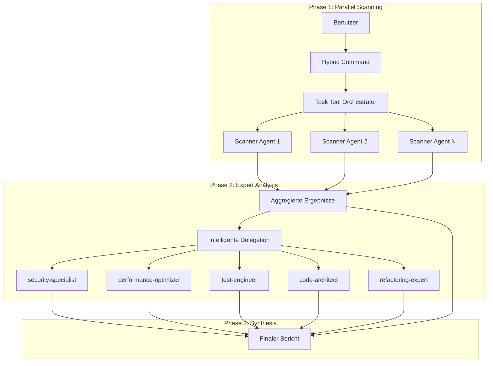

# Hybrid Sub-Agent Architecture

## Übersicht

Die Hybrid-Architektur kombiniert das Beste aus zwei Welten: Die blitzschnelle Parallelverarbeitung des Task Tools mit der tiefen Expertise spezialisierter Claude Code Sub-Agents. Diese Architektur ermöglicht es, komplexe Analysen in Sekunden durchzuführen und dabei sowohl Breite als auch Tiefe zu erreichen.

## Architektur-Diagramm



## Zwei Agent-Typen

### 1. Task Tool Agents (Parallel Scanners)

**Eigenschaften:**

- Schnelle, parallele Ausführung
- Fokussiert auf spezifische Scan-Aufgaben
- Teilen sich den Haupt-Context
- Optimiert für Geschwindigkeit
- JSON-Output für maschinelle Verarbeitung

**Verwendung:**

- Breite Code-Scans
- Pattern-Erkennung
- Metriken-Sammlung
- Quick Checks

**Beispiel:**

```markdown
Task(
description="Security pattern scan",
prompt="Scan for security patterns and return JSON",
subagent_type="general-purpose"
)
```

### 2. Claude Code Sub-Agents (Domain Experts)

**Eigenschaften:**

- Eigene Context-Fenster
- Tiefe Expertise in spezifischen Bereichen
- Persistente Konfiguration
- Detaillierte Analyse-Fähigkeiten
- Markdown-Reports mit Empfehlungen

**Verwendung:**

- Tiefgehende Analyse kritischer Findings
- Experten-Empfehlungen
- Komplexe Problem-Lösungen
- Detaillierte Remediation-Strategien

**Beispiel:**

```yaml
---
name: security-specialist
description: Deep security analysis expert
---
[Detailliertes System-Prompt für Security-Expertise]
```

## Hybrid Command Workflow

### Phase 1: Parallel Scanning (5-8 Sekunden)

1. **Start**: Hybrid Command wird aufgerufen
2. **Orchestrierung**: 10-20 Scanner Agents starten parallel
3. **Scanning**: Jeder Agent scannt spezifische Aspekte
4. **Sammlung**: JSON-Ergebnisse werden aggregiert

### Phase 2: Intelligente Delegation (10-20 Sekunden)

1. **Analyse**: Ergebnisse werden priorisiert
2. **Schwellwert-Check**: Kritische Issues identifiziert
3. **Delegation**: Relevante Sub-Agents werden aktiviert
4. **Experten-Analyse**: Tiefgehende Untersuchung

### Phase 3: Synthesis (2-5 Sekunden)

1. **Kombination**: Scanner- und Experten-Ergebnisse
2. **Deduplication**: Redundanzen entfernen
3. **Priorisierung**: Nach Severity ordnen
4. **Report-Generierung**: Finaler Bericht

## Konfiguration

### .claude-commands.json

```json
{
  "hybridMode": {
    "enabled": true,
    "agentRegistry": {
      "security-specialist": {
        "type": "sub-agent",
        "location": "agents/security-specialist.md",
        "autoInvoke": ["security", "vulnerability"],
        "priority": "high"
      }
    },
    "delegationStrategy": {
      "automatic": true,
      "thresholdScore": 0.7,
      "maxDelegations": 3
    }
  }
}
```

### Konfigurations-Optionen

**agentRegistry**: Registrierte Sub-Agents

- `type`: Agent-Typ (sub-agent oder task-agent)
- `location`: Pfad zur Agent-Definition
- `autoInvoke`: Keywords für automatische Aktivierung
- `priority`: Priorisierung bei mehreren Matches

**delegationStrategy**: Delegations-Verhalten

- `automatic`: Automatische Delegation aktiviert
- `thresholdScore`: Mindest-Score für Delegation (0-1)
- `maxDelegations`: Maximale Anzahl delegierter Agents
- `parallelDelegation`: Parallele Expert-Analyse

## Best Practices

### Wann Hybrid Commands verwenden

**Ideal für:**

- Umfassende Code-Analysen mit Tiefgang
- Security Audits mit Remediation
- Performance-Analysen mit Optimierungen
- Architektur-Reviews mit Refactoring-Plänen

**Weniger geeignet für:**

- Einfache, schnelle Checks
- Single-File-Analysen
- Reine Metriken-Sammlung

### Command Design Guidelines

1. **Phase-Separation**:

   - Klare Trennung zwischen Scan und Analyse
   - Explizite Delegation-Kriterien
   - Strukturierte Synthesis

2. **Performance-Balance**:

   - Scanner: Viele, schnelle Agents (10-20)
   - Experts: Wenige, gründliche Agents (1-5)
   - Gesamtzeit: Unter 30 Sekunden anstreben

3. **Output-Konsistenz**:
   - Scanner: JSON für Maschinen
   - Experts: Markdown für Menschen
   - Synthesis: Kombiniertes Format

### Agent-Entwicklung

**Für Scanner Agents:**

```markdown
- Fokus auf Geschwindigkeit
- Spezifische Pattern-Suche
- Strukturierter JSON-Output
- Minimale Token-Nutzung
```

**Für Expert Sub-Agents:**

```markdown
- Tiefe Domain-Expertise
- Ausführliche Analyse
- Praktische Empfehlungen
- Educative Erklärungen
```

## Beispiel: analyze-deep Command

```markdown
# Phase 1: 10 parallele Scanner

- Complexity Scanner
- Security Scanner
- Performance Scanner
- Architecture Scanner
- ... (6 weitere)

# Phase 2: Delegation basierend auf Findings

if (securityIssues.severity >= "high") {
delegate to security-specialist
}
if (performanceBottlenecks.count > 3) {
delegate to performance-optimizer
}

# Phase 3: Kombinierter Report

- Executive Summary
- Critical Findings (von Experts verifiziert)
- Weitere Findings (von Scannern)
- Priorisierte Action Items
```

## Vorteile der Hybrid-Architektur

1. **Geschwindigkeit + Tiefe**: Schneller Überblick mit Expert-Insights wo nötig
2. **Skalierbarkeit**: Flexibel anpassbar an Projekt-Größe
3. **Context-Management**: Optimale Nutzung von Context-Fenstern
4. **Expertise-Fokus**: Spezialisten nur wo wirklich benötigt
5. **Kosten-Effizienz**: Minimaler Token-Verbrauch durch gezielte Delegation

## Migration von bestehenden Commands

### Von reinen Task-Commands:

1. Identifiziere Bereiche die Expert-Analyse benötigen
2. Erstelle entsprechende Sub-Agents
3. Füge Delegation-Logic hinzu
4. Erweitere Synthesis um Expert-Inputs

### Von manuellen Workflows:

1. Extrahiere wiederkehrende Analyse-Pattern
2. Erstelle Scanner für breite Abdeckung
3. Definiere Expert-Agents für Tiefgang
4. Automatisiere mit Hybrid Command

## Zukunft der Hybrid-Architektur

### Geplante Features:

- **Adaptive Agent-Anzahl**: Basierend auf Codebase-Größe
- **Learning aus Feedback**: Verbesserte Delegation über Zeit
- **Custom Expert-Agents**: Projekt-spezifische Experten
- **Real-time Progress**: Live-Updates während Analyse
- **Result Caching**: Wiederverwendung von Analysen

### Community Extensions:

- Weitere spezialisierte Sub-Agents
- Branchen-spezifische Command-Sets
- Integration mit externen Tools
- Performance-Benchmarks

## Zusammenfassung

Die Hybrid-Architektur ist die Evolution der Sub-Agent Orchestrierung. Sie kombiniert:

- **Task Tool**: Für parallele, breite Analyse
- **Sub-Agents**: Für tiefe, experten-basierte Insights
- **Intelligente Orchestrierung**: Für optimale Ressourcen-Nutzung

Das Resultat: Comprehensive Analysen in Sekunden statt Minuten, mit der Qualität von Experten-Reviews.
