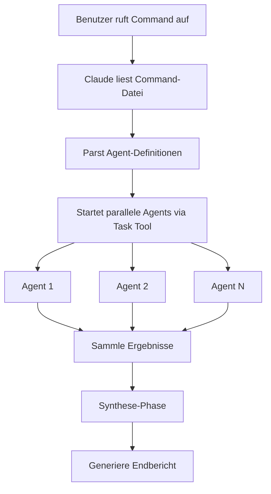
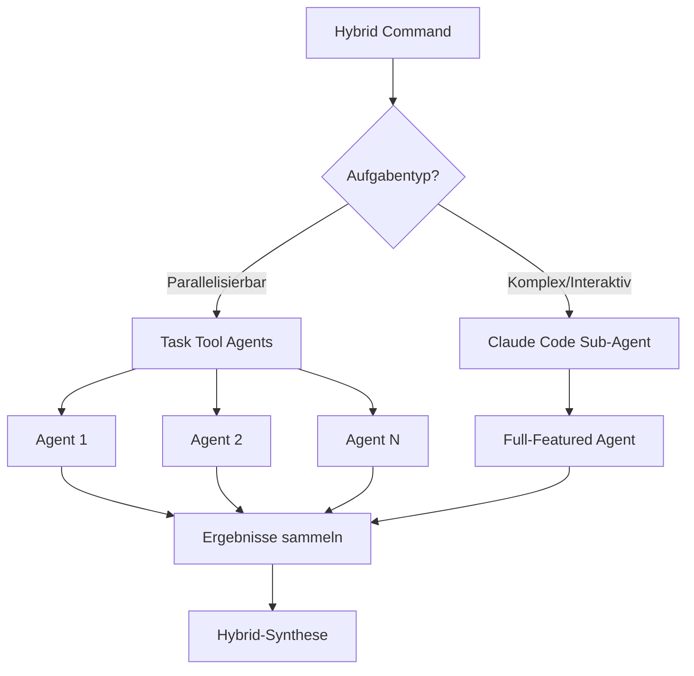

# Technischer Leitfaden: Sub-Agent Orchestrierungssystem

## Inhaltsverzeichnis

1. [Übersicht](#übersicht)
2. [Architektur](#architektur)
3. [Für Repository-Maintainer](#für-repository-maintainer)
4. [Für Endanwender](#für-endanwender)
5. [Konfiguration im Detail](#konfiguration-im-detail)
6. [Eigene Commands erstellen](#eigene-commands-erstellen)
7. [Performance-Optimierung](#performance-optimierung)
8. [Hybrid-Architektur](#hybrid-architektur)
9. [Fehlerbehebung](#fehlerbehebung)

## Übersicht

Das Sub-Agent Orchestrierungssystem ermöglicht es Claude Code, mehrere spezialisierte Agents parallel auszuführen und dabei 5-10x Performance-Verbesserungen bei komplexen Analyseaufgaben zu erzielen. Anstatt Aufgaben sequentiell zu verarbeiten, nutzt das System Claudes Task Tool, um mehrere Agents zu erzeugen, die gleichzeitig arbeiten.

### Kernkomponenten

1. **Commands** (`/commands/`): Markdown-Dateien mit Agent-Orchestrierungsanweisungen
2. **Konfiguration** (`.claude-commands.json`): Systemweite und command-spezifische Einstellungen
3. **Hilfsskripte** (`/scripts/`): Tools zum Erstellen und Verwalten von Commands
4. **Templates** (`/commands/templates/`): Ausgangspunkte für neue Commands

## Architektur

### Funktionsweise



### Command-Struktur

Jede Command-Datei enthält:

```markdown
---
allowed-tools: Task, Read, Grep, Bash(fd:*), Bash(rg:*)
description: Kurze Beschreibung für Command-Auflistung
argument-hint: [erwartete-argumente]
---

# Command-Ausführungsanweisungen
```

Das Frontmatter definiert:

- `allowed-tools`: Verfügbare Tools für Agents
- `description`: Erscheint in Command-Listen
- `argument-hint`: Hilft bei der Auto-Vervollständigung

### Agent-Definitionsmuster

```markdown
1. **Agent Name**: Task(
   description="Kurze Aufgabenbeschreibung",
   prompt="Detaillierte Anweisungen für den Agent...",
   subagent_type="general-purpose"
   )
```

## Für Repository-Maintainer

### Verzeichnisstruktur

```text
claude-code-toolkit/
├── .claude-commands.json          # Globale Konfiguration
├── commands/
│   ├── orchestration/            # Analyse & Performance Commands
│   │   ├── analyze-parallel.md
│   │   ├── security-audit.md
│   │   └── ...
│   ├── research/                 # Research & Investigation Commands
│   │   ├── deep-dive.md
│   │   └── ...
│   └── templates/                # Command-Templates
│       ├── basic-sub-agent.md
│       └── ...
└── scripts/
    ├── create-sub-agent-command.sh  # Command-Generator
    └── update-readme.sh             # Dokumentations-Updater
```

### Konfigurationsdatei: `.claude-commands.json`

Die Konfigurationsdatei steuert das Systemverhalten:

```json
{
  "subAgentOrchestration": {
    "enabled": true,
    "performanceMode": "balanced", // conservative|balanced|aggressive

    "defaults": {
      "tokenBudget": 3000, // Tokens pro Agent
      "timeout": 30000, // Millisekunden
      "maxRetries": 2,
      "parallelExecution": true
    },

    "commandOverrides": {
      "orchestration:security-audit": {
        "performanceMode": "conservative" // Überschreibung für spezifischen Command
      }
    }
  }
}
```

### Neue Commands hinzufügen

1. **Mit dem Hilfsskript** (empfohlen):

   ```bash
   ./scripts/create-sub-agent-command.sh \
     --name "meine-analyse" \
     --agents 8 \
     --category orchestration \
     --description "Eigene Analyse mit 8 Agents"
   ```

2. **Manuelle Erstellung**:

   - Template aus `/commands/templates/` kopieren
   - Agent-Anzahl und Prompts anpassen
   - In passenden Kategorie-Ordner speichern

3. **Dokumentation aktualisieren**:

   ```bash
   ./scripts/update-readme.sh
   ```

### Performance-Modi erklärt

| Modus        | Max Agents | Token Budget | Timeout | Anwendungsfall            |
| ------------ | ---------- | ------------ | ------- | ------------------------- |
| Conservative | 5          | 2000         | 20s     | Begrenzte Ressourcen      |
| Balanced     | 10         | 3000         | 30s     | Standard, meiste Aufgaben |
| Aggressive   | 20         | 4000         | 45s     | Große Codebases           |

## Für Endanwender

### Installation

```bash
# Installation mit Standard "global" Prefix
curl -fsSL https://raw.githubusercontent.com/username/repo/main/install.sh | bash -s -- global

# Eigener Prefix
curl -fsSL https://raw.githubusercontent.com/username/repo/main/install.sh | bash -s -- meinprefix
```

### Commands verwenden

Commands folgen dem Muster: `/prefix:kategorie:command`

```bash
# Beispiele
/global:orchestration:analyze-parallel src/
/global:orchestration:security-audit --severity=critical
/global:research:deep-dive "authentication patterns"
```

### Command-Kategorien

**Orchestration Commands** - Code-Analyse und Qualitätsprüfungen:

- `analyze-parallel`: 10 Agents für umfassende Code-Analyse
- `security-audit`: 8 Agents für Security-Vulnerability-Scanning
- `refactor-impact`: 6 Agents zur Bewertung von Refactoring-Konsequenzen
- `test-coverage`: 5 Agents für Test-Qualitätsanalyse
- `performance-scan`: 7 Agents für Performance-Profiling

**Research Commands** - Untersuchung und Dokumentation:

- `deep-dive`: 8 Agents für Multi-Perspektiven-Research
- `codebase-map`: 10 Agents zur Kartierung der gesamten Codebase-Struktur
- `dependency-trace`: 6 Agents für Dependency-Analyse

### Output verstehen

Commands produzieren typischerweise:

1. **Executive Summary**: High-Level-Erkenntnisse
2. **Detailanalyse**: Kategorie-spezifische Ergebnisse
3. **Action Items**: Priorisierte nächste Schritte
4. **Metriken**: Performance- und Qualitätswerte

## Konfiguration im Detail

### Projekt-Level-Konfiguration

Erstelle `.claude-commands.json` im Projekt-Root:

```json
{
  "subAgentOrchestration": {
    "performanceMode": "aggressive", // Überschreibt globalen Standard
    "synthesis": {
      "format": "json", // json|markdown|csv
      "prioritization": "severity" // severity|impact|effort
    }
  }
}
```

### Command-spezifische Überschreibungen

In `.claude-commands.json`:

```json
{
  "commandOverrides": {
    "orchestration:security-audit": {
      "performanceMode": "conservative",
      "synthesis": {
        "prioritization": "cvss-score"
      }
    }
  }
}
```

### Umgebungsvariablen

```bash
# Performance-Modus überschreiben
export CLAUDE_PERFORMANCE_MODE=conservative

# Debug-Logging aktivieren
export CLAUDE_DEBUG=true

# Eigenes Cache-Verzeichnis setzen
export CLAUDE_CACHE_DIR=~/mein-cache
```

## Eigene Commands erstellen

### Mit `create-sub-agent-command.sh`

Das Hilfsskript vereinfacht die Command-Erstellung:

```bash
# Grundlegende Verwendung
./scripts/create-sub-agent-command.sh --name "mein-command" --agents 6

# Alle Optionen
./scripts/create-sub-agent-command.sh \
  --name "api-analyzer" \
  --agents 8 \
  --category orchestration \
  --template analysis \
  --description "Analysiert API-Design-Patterns"
```

Optionen:

- `-n, --name`: Command-Name (erforderlich)
- `-a, --agents`: Anzahl der Agents (2-20, Standard: 5)
- `-c, --category`: orchestration|research|custom
- `-t, --template`: basic|analysis|research
- `-d, --description`: Kurze Beschreibung

### Manuelle Command-Erstellung

1. **Template wählen**:

   - `basic-sub-agent.md`: Allgemeiner Zweck
   - `analysis-sub-agent.md`: Code-Analyse-Fokus
   - `research-sub-agent.md`: Research und Dokumentation

2. **Agents definieren**:

   ```markdown
   1. **Spezifischer Aufgaben-Agent**: Task(
      description="Analysiere spezifischen Aspekt",
      prompt="Detaillierte Anweisungen inklusive: 1) Was analysiert werden soll 2) Zu verwendende Tools (rg, fd, etc.) 3) Output-Format (JSON/Markdown)
      Strukturierte Ergebnisse zurückgeben.",
      subagent_type="general-purpose"
      )
   ```

3. **Synthese-Logik entwerfen**:
   - Wie Ergebnisse zusammengeführt werden
   - Deduplizierungsstrategie
   - Prioritätsberechnung
   - Report-Generierung

### Best Practices

1. **Agent-Design**:

   - Agents auf einzelne Verantwortlichkeiten fokussieren
   - Klare Output-Format-Anweisungen geben
   - Spezifische Tool-Nutzungshinweise einschließen
   - Vernünftige Token-Budgets setzen

2. **Performance**:

   - Mit weniger Agents beginnen, bei Bedarf skalieren
   - `conservative`-Modus für große Dateien verwenden
   - Token-Nutzung mit Metriken überwachen

3. **Fehlerbehandlung**:
   - Für Teilausfälle planen
   - Fallback-Strategien einbauen
   - Wichtige Fehler loggen

## Performance-Optimierung

### Agent-Anzahl optimieren

```text
Agents | Anwendungsfall
-------|---------------
2-4    | Einfache, fokussierte Analyse
5-8    | Standard Code-Analyse
9-12   | Umfassende Reviews
13-20  | Große Codebase-Analyse
```

### Token-Budget-Management

```json
{
  "defaults": {
    "tokenBudget": 3000 // Pro Agent
  }
}
```

Richtlinien:

- Einfache Analyse: 1500-2000 Tokens
- Standard-Aufgaben: 2500-3500 Tokens
- Komplexe Research: 3500-5000 Tokens

### Caching-Strategie

Caching für wiederholte Analysen aktivieren:

```json
{
  "caching": {
    "enabled": true,
    "ttl": 3600, // 1 Stunde
    "cacheLocation": "~/.claude/cache/sub-agents"
  }
}
```

## Hybrid-Architektur

### Überblick

Die Hybrid-Architektur kombiniert die Leistungsfähigkeit des Task Tools für parallele Agent-Orchestrierung mit der Flexibilität von Claude Code Sub-Agents. Dieser Ansatz ermöglicht es, das Beste aus beiden Welten zu nutzen: die Performance-Vorteile der parallelen Ausführung und die erweiterten Fähigkeiten von Claude Code für komplexe, interaktive Aufgaben.

### Der Hybrid-Ansatz

#### Kombination von Task Tool und Claude Code Sub-Agents

Die Hybrid-Architektur nutzt zwei komplementäre Ansätze:

1. **Task Tool Agents**: Für parallelisierbare, gut definierte Aufgaben

   - Schnelle, parallele Ausführung
   - Begrenzte Tool-Palette
   - Ideal für Analyse, Suche und strukturierte Datenverarbeitung

2. **Claude Code Sub-Agents**: Für komplexe, interaktive Aufgaben
   - Voller Zugriff auf alle Claude Code Tools
   - Sequentielle aber mächtige Verarbeitung
   - Ideal für Code-Generierung, komplexe Refactorings und interaktive Workflows



### Konfiguration für hybridMode

#### Globale Konfiguration in `.claude-commands.json`

```json
{
  "subAgentOrchestration": {
    "enabled": true,
    "hybridMode": {
      "enabled": true,
      "strategy": "adaptive", // adaptive|manual|threshold
      "thresholds": {
        "complexity": 0.7, // Schwellenwert für automatische Sub-Agent-Nutzung
        "fileCount": 50, // Dateien-Anzahl für Sub-Agent-Aktivierung
        "codebaseSize": "10MB" // Codebase-Größe für Sub-Agent-Nutzung
      },
      "fallbackBehavior": "degrade-gracefully" // fail|degrade-gracefully|force-sequential
    },

    "agentCapabilities": {
      "taskAgents": {
        "maxParallel": 10,
        "allowedTools": ["Read", "Grep", "Bash(fd:*)", "Bash(rg:*)"],
        "tokenBudget": 3000
      },
      "subAgents": {
        "maxSequential": 3,
        "allowedTools": "all", // Voller Tool-Zugriff
        "tokenBudget": 8000,
        "interactionMode": "autonomous" // autonomous|guided
      }
    }
  }
}
```

#### Command-spezifische Hybrid-Konfiguration

```json
{
  "commandOverrides": {
    "orchestration:hybrid-refactor": {
      "hybridMode": {
        "strategy": "manual",
        "agentDistribution": {
          "analysis": "task", // Analyse-Phase mit Task Agents
          "implementation": "sub", // Implementation mit Sub-Agents
          "validation": "task" // Validierung wieder mit Task Agents
        }
      }
    }
  }
}
```

### Hybrid Commands erstellen

#### 1. Basic Hybrid Command Struktur

```markdown
---
allowed-tools: Task, Read, Grep, Bash, Edit, Write, MultiEdit
description: Hybrid-Analyse mit automatischer Agent-Auswahl
argument-hint: [target-directory] [options]
hybrid-mode: true
---

# Hybrid Command Execution

## Phase 1: Parallele Analyse (Task Agents)

Analysiere die Codebase mit spezialisierten Task Agents:

1. **Structure Analyzer**: Task(
   description="Analysiere Projekt-Struktur",
   prompt="Verwende fd und rg um die Architektur zu verstehen...",
   subagent_type="general-purpose"
   )

2. **Pattern Detector**: Task(
   description="Erkenne Code-Patterns",
   prompt="Suche nach gängigen Patterns und Anti-Patterns...",
   subagent_type="general-purpose"
   )

## Phase 2: Komplexe Verarbeitung (Claude Code Sub-Agent)

Basierend auf den Analyse-Ergebnissen, führe komplexe Operationen aus:

3. **Refactoring Agent**: SubAgent(
   description="Führe identifizierte Refactorings durch",
   prompt="Nutze die Analyse-Ergebnisse um: 1) Code zu refaktorisieren 2) Tests anzupassen 3) Dokumentation zu aktualisieren
   Verwende Edit/MultiEdit für Änderungen.",
   capabilities="full-claude-code"
   )

## Phase 3: Validierung (Task Agents)

4. **Test Runner**: Task(
   description="Führe Tests aus und validiere Änderungen",
   prompt="Verwende Bash um Tests auszuführen...",
   subagent_type="general-purpose"
   )
```

#### 2. Adaptive Hybrid Command

```markdown
---
hybrid-mode: adaptive
adaptive-rules:
  - condition: "fileCount > 100"
    use: "task-agents"
  - condition: "requiresCodeGeneration"
    use: "sub-agent"
---

# Adaptive Hybrid Workflow

Das System wählt automatisch den optimalen Agent-Typ basierend auf:

- Anzahl der zu verarbeitenden Dateien
- Komplexität der erforderlichen Operationen
- Verfügbare System-Ressourcen
```

### Migration von Task-basierten zu Hybrid Commands

#### Schritt 1: Bestehenden Command analysieren

```bash
# Analysiere vorhandene Task-basierte Commands
grep -l "Task(" commands/orchestration/*.md | while read file; do
  echo "Analyzing: $file"
  # Prüfe auf Komplexität und mögliche Sub-Agent-Kandidaten
done
```

#### Schritt 2: Hybrid-Kandidaten identifizieren

Kriterien für Hybrid-Migration:

- Commands mit Code-Generierung oder -Modifikation
- Workflows mit mehreren sequentiellen Phasen
- Aufgaben, die User-Interaktion benötigen könnten
- Commands, die von erweiterten Tool-Fähigkeiten profitieren würden

#### Schritt 3: Schrittweise Migration

```markdown
<!-- Original Task-only Command -->

1. **Analyzer**: Task(
   description="Analysiere und modifiziere Code",
   prompt="Finde Patterns und schlage Änderungen vor...",
   )

<!-- Migrated Hybrid Version -->

1. **Analyzer**: Task(
   description="Analysiere Code-Patterns",
   prompt="Finde Patterns und erstelle Änderungsliste...",
   )

2. **Modifier**: SubAgent(
   description="Implementiere vorgeschlagene Änderungen",
   prompt="Nutze die Analyse-Ergebnisse um Code zu modifizieren...",
   capabilities="full-claude-code"
   )
```

#### Schritt 4: Testen und Validieren

```bash
# Test-Skript für Hybrid-Migration
./scripts/test-hybrid-command.sh \
  --original "commands/orchestration/old-command.md" \
  --hybrid "commands/orchestration/new-hybrid-command.md" \
  --test-cases "test/cases/hybrid-migration.json"
```

### Best Practices für Hybrid-Entwicklung

#### 1. Agent-Typ-Auswahl

**Verwende Task Agents für:**

- Parallele Dateisuche und -analyse
- Pattern-Erkennung über viele Dateien
- Metriken-Sammlung und Reporting
- Read-only Operationen

**Verwende Claude Code Sub-Agents für:**

- Code-Generierung und -Modifikation
- Komplexe Multi-File-Refactorings
- Interaktive Debugging-Sessions
- Aufgaben mit bedingter Logik

#### 2. Performance-Optimierung

```json
{
  "hybridOptimization": {
    "pipelineStrategy": "streaming", // streaming|batch|adaptive
    "memoryManagement": {
      "shareContextBetweenPhases": true,
      "maxContextSize": "50MB",
      "compressionEnabled": true
    },
    "executionHints": {
      "preferParallelWhenPossible": true,
      "subAgentPooling": true,
      "reuseAnalysisResults": true
    }
  }
}
```

#### 3. Fehlerbehandlung in Hybrid-Umgebungen

````markdown
## Fehlerbehandlungs-Strategie

1. **Graceful Degradation**:

   - Wenn Sub-Agents fehlschlagen, auf Task Agents zurückfallen
   - Partielle Ergebnisse akzeptieren und fortfahren

2. **Rollback-Mechanismen**:

   - Änderungen von Sub-Agents in Transaktionen kapseln
   - Automatisches Rollback bei Validierungsfehlern

3. **Hybrid-spezifisches Logging**:
   ```json
   {
     "logging": {
       "hybridEvents": true,
       "agentTransitions": true,
       "performanceMetrics": {
         "compareAgentTypes": true,
         "trackSwitchingOverhead": true
       }
     }
   }
   ```
````

````

#### 4. Erweiterte Hybrid-Patterns

**Pattern 1: Analyse-Modifikation-Validierung**
```markdown
Phase 1: Parallele Analyse (Task Agents) →
Phase 2: Gezielte Modifikation (Sub-Agent) →
Phase 3: Parallele Validierung (Task Agents)
````

**Pattern 2: Progressive Enhancement**

```markdown
Basis-Analyse (Task) →
Wenn komplex: Tiefenanalyse (Sub-Agent) →
Optimierung (Task)
```

**Pattern 3: Fail-Safe Hybrid**

```markdown
Versuche parallele Ausführung (Task) →
Bei Timeout/Fehler: Sequential mit Sub-Agent →
Konsolidiere Ergebnisse
```

#### 5. Metriken und Monitoring

```json
{
  "hybridMetrics": {
    "track": [
      "agentTypeDistribution",
      "switchingFrequency",
      "performanceComparison",
      "resourceUtilization"
    ],
    "reporting": {
      "compareBaselines": true,
      "showHybridAdvantage": true,
      "identifyBottlenecks": true
    }
  }
}
```

### Zusammenfassung

Die Hybrid-Architektur bietet maximale Flexibilität und Performance durch intelligente Kombination von Task Tools und Claude Code Sub-Agents. Durch sorgfältige Konfiguration und durchdachtes Command-Design können Entwickler Commands erstellen, die automatisch die optimale Ausführungsstrategie für jede Aufgabe wählen.

## Fehlerbehebung

### Häufige Probleme

#### "Token limit exceeded"

- `tokenBudget` in Konfiguration reduzieren
- Weniger Agents verwenden
- Zu `conservative` Performance-Modus wechseln

#### "Agent timeout"

- Timeout in Konfiguration erhöhen
- Aufgabenkomplexität reduzieren
- Auf Endlosschleifen in Prompts prüfen

#### "Synthesis failed"

- Prüfen, ob alle Agents erwartetes Format zurückgeben
- Auf JSON-Parsing-Fehler prüfen
- Debug-Logging aktivieren

### Debug-Modus

Detailliertes Logging aktivieren:

```bash
export CLAUDE_DEBUG=true
export CLAUDE_LOG_LEVEL=debug
```

### Performance-Metriken

Command-Performance überwachen:

```json
{
  "metrics": {
    "trackPerformance": true,
    "logLocation": "~/.claude/logs/sub-agent-metrics.log"
  }
}
```

Erfasste Metriken:

- Ausführungszeit pro Agent
- Token-Nutzung
- Erfolgs-/Fehlerquoten
- Speedup-Faktor vs. sequenziell

### Hilfe erhalten

1. Command-spezifische Dokumentation prüfen
2. Agent-Outputs auf Fehler überprüfen
3. Metrik-Logs untersuchen
4. Issues einreichen mit:
   - Verwendetem Command
   - Fehlermeldungen
   - Performance-Metriken
   - Konfigurationseinstellungen
