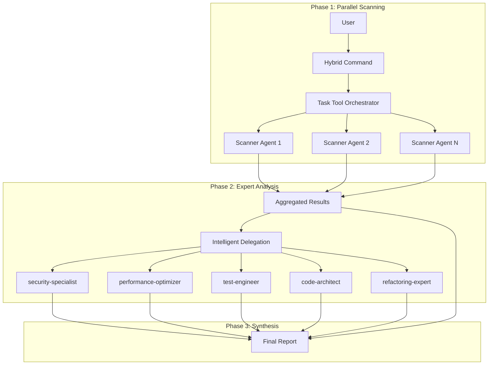

# Hybrid Sub-Agent Architecture

## Overview

The Hybrid Architecture combines the best of both worlds: the lightning-fast parallel processing of the Task Tool with the deep expertise of specialized Claude Code Sub-Agents. This architecture enables complex analyses to be performed in seconds while achieving both breadth and depth.

## Architecture Diagram



## Two Agent Types

### 1. Task Tool Agents (Parallel Scanners)

**Characteristics:**

- Fast, parallel execution
- Focused on specific scan tasks
- Share the main context
- Optimized for speed
- JSON output for machine processing

**Usage:**

- Broad code scans
- Pattern detection
- Metrics collection
- Quick checks

**Example:**

```markdown
Task(
description="Security pattern scan",
prompt="Scan for security patterns and return JSON",
subagent_type="general-purpose"
)
```

### 2. Claude Code Sub-Agents (Domain Experts)

**Characteristics:**

- Own context windows
- Deep expertise in specific areas
- Persistent configuration
- Detailed analysis capabilities
- Markdown reports with recommendations

**Usage:**

- In-depth analysis of critical findings
- Expert recommendations
- Complex problem solutions
- Detailed remediation strategies

**Example:**

```yaml
---
name: security-specialist
description: Deep security analysis expert
---
[Detailed system prompt for security expertise]
```

## Hybrid Command Workflow

### Phase 1: Parallel Scanning (5-8 seconds)

1. **Start**: Hybrid command is invoked
2. **Orchestration**: 10-20 scanner agents start in parallel
3. **Scanning**: Each agent scans specific aspects
4. **Collection**: JSON results are aggregated

### Phase 2: Intelligent Delegation (10-20 seconds)

1. **Analysis**: Results are prioritized
2. **Threshold Check**: Critical issues identified
3. **Delegation**: Relevant sub-agents are activated
4. **Expert Analysis**: In-depth investigation

### Phase 3: Synthesis (2-5 seconds)

1. **Combination**: Scanner and expert results
2. **Deduplication**: Remove redundancies
3. **Prioritization**: Order by severity
4. **Report Generation**: Final report

## Configuration

### .claude-commands.json

```json
{
  "hybridMode": {
    "enabled": true,
    "agentRegistry": {
      "security-specialist": {
        "type": "sub-agent",
        "location": "agents/security-specialist.md",
        "autoInvoke": ["security", "vulnerability"],
        "priority": "high"
      }
    },
    "delegationStrategy": {
      "automatic": true,
      "thresholdScore": 0.7,
      "maxDelegations": 3
    }
  }
}
```

### Configuration Options

**agentRegistry**: Registered sub-agents

- `type`: Agent type (sub-agent or task-agent)
- `location`: Path to agent definition
- `autoInvoke`: Keywords for automatic activation
- `priority`: Prioritization for multiple matches

**delegationStrategy**: Delegation behavior

- `automatic`: Automatic delegation enabled
- `thresholdScore`: Minimum score for delegation (0-1)
- `maxDelegations`: Maximum number of delegated agents
- `parallelDelegation`: Parallel expert analysis

## Best Practices

### When to Use Hybrid Commands

**Ideal for:**

- Comprehensive code analyses with depth
- Security audits with remediation
- Performance analyses with optimizations
- Architecture reviews with refactoring plans

**Less suitable for:**

- Simple, quick checks
- Single-file analyses
- Pure metrics collection

### Command Design Guidelines

1. **Phase Separation**:

   - Clear separation between scan and analysis
   - Explicit delegation criteria
   - Structured synthesis

2. **Performance Balance**:

   - Scanners: Many, fast agents (10-20)
   - Experts: Few, thorough agents (1-5)
   - Total time: Aim for under 30 seconds

3. **Output Consistency**:
   - Scanners: JSON for machines
   - Experts: Markdown for humans
   - Synthesis: Combined format

### Agent Development

**For Scanner Agents:**

```markdown
- Focus on speed
- Specific pattern search
- Structured JSON output
- Minimal token usage
```

**For Expert Sub-Agents:**

```markdown
- Deep domain expertise
- Detailed analysis
- Practical recommendations
- Educational explanations
```

## Example: analyze-deep Command

```markdown
# Phase 1: 10 parallel scanners

- Complexity Scanner
- Security Scanner
- Performance Scanner
- Architecture Scanner
- ... (6 more)

# Phase 2: Delegation based on findings

if (securityIssues.severity >= "high") {
delegate to security-specialist
}
if (performanceBottlenecks.count > 3) {
delegate to performance-optimizer
}

# Phase 3: Combined report

- Executive Summary
- Critical Findings (verified by experts)
- Additional Findings (from scanners)
- Prioritized Action Items
```

## Advantages of Hybrid Architecture

1. **Speed + Depth**: Quick overview with expert insights where needed
2. **Scalability**: Flexibly adaptable to project size
3. **Context Management**: Optimal use of context windows
4. **Expertise Focus**: Specialists only where truly needed
5. **Cost Efficiency**: Minimal token consumption through targeted delegation

## Migration from Existing Commands

### From Pure Task Commands

1. Identify areas needing expert analysis
2. Create corresponding sub-agents
3. Add delegation logic
4. Extend synthesis with expert inputs

### From Manual Workflows

1. Extract recurring analysis patterns
2. Create scanners for broad coverage
3. Define expert agents for depth
4. Automate with hybrid command

## Future of Hybrid Architecture

### Planned Features

- **Adaptive Agent Count**: Based on codebase size
- **Learning from Feedback**: Improved delegation over time
- **Custom Expert Agents**: Project-specific experts
- **Real-time Progress**: Live updates during analysis
- **Result Caching**: Reuse of analyses

### Community Extensions

- Additional specialized sub-agents
- Industry-specific command sets
- Integration with external tools
- Performance benchmarks

## Summary

The Hybrid Architecture is the evolution of sub-agent orchestration. It combines:

- **Task Tool**: For parallel, broad analysis
- **Sub-Agents**: For deep, expert-based insights
- **Intelligent Orchestration**: For optimal resource usage

The result: Comprehensive analyses in seconds instead of minutes, with the quality of expert reviews.
