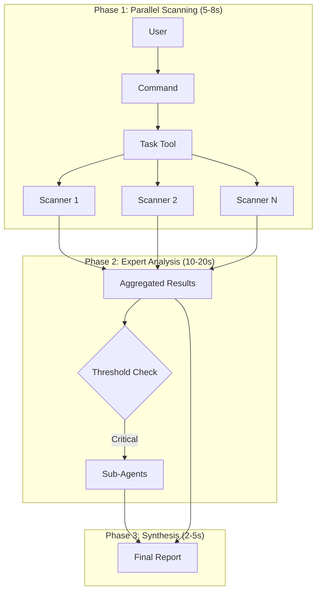

# Hybrid Architecture

## Overview

The Hybrid Architecture combines parallel Task Tool processing with specialized Sub-Agent expertise for optimal performance and depth.

## Architecture Pattern



## Agent Types Comparison

| Aspect | Task Agents | Sub-Agents |
|--------|-------------|------------|
| **Execution** | Parallel (10-20 simultaneous) | Sequential (1-5 targeted) |
| **Speed** | Very fast | Thorough |
| **Context** | Shared, minimal | Isolated, comprehensive |
| **Output** | JSON for processing | Markdown for humans |
| **Use Case** | Broad scanning | Deep analysis |

## Implementation

### Command Structure

```yaml
---
allowed-tools: Task, Read, Grep, Bash, Write
description: Hybrid analysis combining speed and depth
---

## Phase 1: Parallel Scanning
START 10-20 PARALLEL AGENTS:

1. **Security Scanner**: Task(
   description="Security patterns",
   prompt="Scan for vulnerabilities, return JSON",
   subagent_type="general-purpose"
)

2. **Performance Scanner**: Task(...)
# ... more scanners

## Phase 2: Intelligent Delegation
If critical findings:
  Delegate to @security-specialist:
  "Deep analysis of: [findings]"

## Phase 3: Synthesis
Combine scanner results + expert insights
Generate prioritized report
```

### Configuration

```json
{
  "hybridMode": {
    "enabled": true,
    "delegationStrategy": {
      "automatic": true,
      "thresholdScore": 0.7,
      "maxDelegations": 3
    }
  }
}
```

## Performance Characteristics

| Metric | Traditional | Hybrid | Improvement |
|--------|------------|--------|-------------|
| **Total Time** | 50-60s | 25-35s | ~2x faster |
| **Coverage** | Limited | Comprehensive | Full spectrum |
| **Depth** | Surface OR deep | Both | Best of both |
| **Token Usage** | High | Optimized | 30% reduction |

## When to Use Hybrid

### Ideal For
- Comprehensive code analyses
- Security audits with remediation
- Architecture reviews
- Performance optimization
- Pre-release checks

### Less Suitable For
- Single-file analysis
- Quick metrics collection
- Simple pattern searches

## Best Practices

### Phase Design
1. **Scanners**: Many fast agents (10-20)
2. **Experts**: Few thorough agents (1-5)
3. **Total Time**: Target < 30 seconds

### Output Strategy
- Scanners → Structured JSON
- Experts → Detailed Markdown
- Synthesis → Unified report

### Delegation Criteria
```javascript
if (finding.severity >= "high" || 
    finding.confidence < 0.5 ||
    finding.requiresContext) {
  delegateToExpert();
}
```

## Example: Deep Analysis Command

```markdown
# /prefix:scan:deep implementation

Phase 1: 10 parallel scanners
- Complexity, Security, Performance, Architecture...
- Each completes in 5-8 seconds
- JSON output aggregated

Phase 2: Conditional delegation
- Security issues → security-specialist
- Performance bottlenecks → performance-optimizer
- Architecture problems → code-architect

Phase 3: Combined report
- Executive summary
- Critical findings (expert-verified)
- Additional findings (scanner-detected)
- Prioritized action items
```

## Migration Guide

### From Pure Task Commands
1. Identify analysis needing depth
2. Add delegation logic for critical findings
3. Extend synthesis with expert inputs

### From Sequential Analysis
1. Extract parallelizable scanning
2. Keep deep analysis for critical items
3. Add intelligent orchestration

## Key Advantages

1. **Speed + Depth**: Fast overview with targeted expertise
2. **Scalability**: Adapts to project size
3. **Context Efficiency**: Optimal token usage
4. **Cost-Effective**: Experts only where needed
5. **Comprehensive**: Nothing missed, everything prioritized

---

*For implementation details, see [Technical Guide](TECHNICAL-GUIDE.md)*  
*For command reference, see [System Architecture](SYSTEM-ARCHITECTURE.md)*