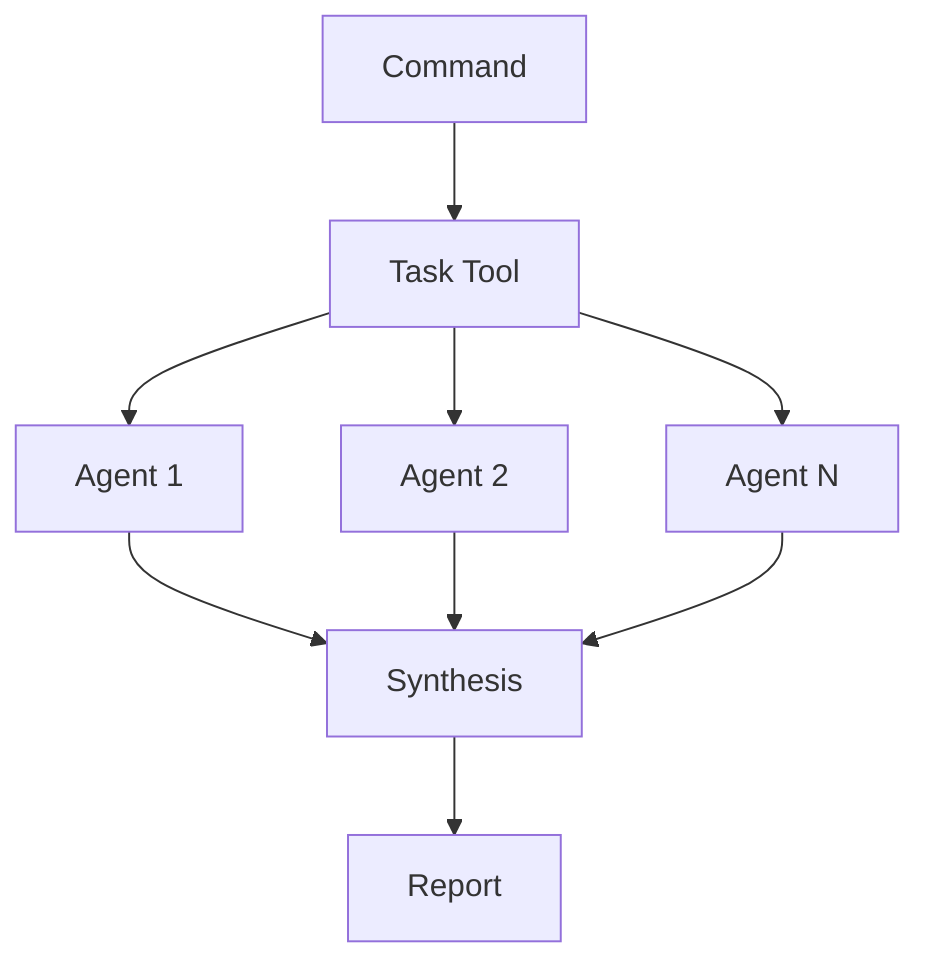

# Sub-Agent Orchestration

## Overview

Sub-Agent Orchestration uses Claude Code's Task Tool to execute multiple specialized agents in parallel, significantly improving performance for complex analyses.

## Quick Start

### Installation

```bash
# Clone repository first
git clone https://github.com/user/claude-code-toolkit.git
cd claude-code-toolkit

# Install with custom prefix
./install.sh myprefix
```

### Basic Usage

```bash
# Parallel code analysis
/myprefix:scan:deep src/

# Security audit  
/myprefix:sec:audit --severity=high

# Test coverage analysis
/myprefix:test:coverage --detailed
```

## Architecture

### Task Tool as Orchestrator

```yaml
allowed-tools: Task, Read, Grep, Bash(fd:*), Bash(rg:*)
```

The Task Tool spawns multiple agents that work simultaneously:



### Token Management

| Aspect | Configuration |
|--------|--------------|
| Per Agent | 2000-4000 tokens |
| Total Budget | ~30000 for 10 agents |
| Output Format | JSON/Markdown structured |

## Command Reference

### Analysis Commands

| Command | Agents | Purpose |
|---------|--------|---------|
| `scan:deep` | 10 | Comprehensive analysis |
| `scan:quick` | 5 | Rapid overview |
| `sec:audit` | 8 | Security vulnerabilities |
| `test:coverage` | 5 | Test quality analysis |
| `perf:scan` | 7 | Performance profiling |

### Each Agent's Focus

**Deep Analysis (`scan:deep`):**

- Code complexity
- Duplicate detection
- Style violations  
- Documentation coverage
- Dead code
- Type safety
- Security patterns
- Performance issues
- Test quality
- Dependencies

## Creating Custom Commands

### Using Helper Script

```bash
./scripts/create-sub-agent-command.sh \
  --name "my-analysis" \
  --agents 6 \
  --category scan
```

### Manual Creation Template

```markdown
---
allowed-tools: Task, Read, Grep, Bash
description: Custom parallel analysis
argument-hint: [directory] [--options]
---

# Command Name

## Sub-Agent Strategy

**START [N] PARALLEL AGENTS:**

1. **Agent Name**: Task(
   description="Specific task",
   prompt="Detailed instructions...",
   subagent_type="general-purpose"
)

2. **Agent Name**: Task(...)

## Synthesis
Combine results and generate report
```

## Best Practices

### When to Use Sub-Agents

✅ **Use for:**

- Multi-file analyses
- Code quality checks
- Security audits
- Performance profiling
- Documentation tasks

❌ **Avoid for:**

- Single-file edits
- Sequential changes
- Direct modifications

### Task Decomposition Patterns

| Pattern | Example |
|---------|---------|
| **Domain-based** | Frontend, Backend, Database, API |
| **Concern-based** | Security, Performance, Quality, Docs |
| **File-based** | Core, Tests, Config, Documentation |

### Performance Optimization

```json
{
  "subAgentOrchestration": {
    "tokenBudget": 3000,
    "timeout": 30000,
    "performanceMode": "balanced"
  }
}
```

**Agent Count Guidelines:**

- 2-4: Simple analysis
- 5-8: Standard tasks
- 9-12: Comprehensive review
- 13-20: Large codebase

## Configuration

### Global Settings

```json
{
  "subAgentOrchestration": {
    "enabled": true,
    "performanceMode": "balanced",
    "defaults": {
      "tokenBudget": 3000,
      "timeout": 30000,
      "parallelExecution": true
    }
  }
}
```

### Performance Modes

| Mode | Max Agents | Token Budget | Timeout |
|------|------------|--------------|---------|
| Conservative | 5 | 2000 | 20s |
| Balanced | 10 | 3000 | 30s |
| Aggressive | 20 | 4000 | 45s |

## Integration Examples

### Git Hooks

```bash
#!/bin/bash
# .git/hooks/pre-commit
claude-code /myprefix:scan:quick --focus=changes
```

### CI/CD Pipeline

```yaml
- name: Code Analysis
  run: |
    /prefix:scan:deep .
    /prefix:sec:audit --fail-on-critical
```

## Troubleshooting

| Issue | Solution |
|-------|----------|
| Token limit exceeded | Reduce `tokenBudget` or agent count |
| Agent timeout | Increase timeout or simplify tasks |
| Synthesis failed | Check output format consistency |

### Debug Mode

```bash
export CLAUDE_DEBUG=true
export CLAUDE_LOG_LEVEL=debug
```

## Performance Metrics

Commands automatically track:

- Execution time per agent
- Token usage
- Success/failure rates
- Speedup vs sequential

Example output:

```
[PERF] scan:deep completed:
- Total time: 6.2s
- Agents: 10
- Speedup: 8x
- Tokens: 28,450
```

---

*For hybrid architecture, see [Hybrid Architecture](HYBRID-ARCHITECTURE.md)*  
*For technical details, see [Technical Guide](TECHNICAL-GUIDE.md)*
