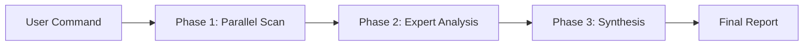

# Claude Code Toolkit: System Architecture

## Overview

The Claude Code Toolkit is a comprehensive collection of commands, agents, and tools that extends Claude Code capabilities through intelligent orchestration and automation.

### Quick Start Workflow

```bash
# 1. Deep analysis with export
/prefix:scan:deep . --export-json

# 2. Generate executable action plan  
/prefix:scan:report --latest --generate-action-plan

# 3. Execute fixes automatically
/prefix:auto:execute --latest

# 4. View completion report
/prefix:auto:report
```

## Core Concepts

### 1. Zero-Friction Workflow

- **Analysis → Action Plan → Execution → Report**
- ROI-based prioritization for maximum efficiency
- Automated execution with supervision options

### 2. Hybrid Architecture

| Phase | Duration | Description |
|-------|----------|-------------|
| **Scan** | 5-8s | Parallel scanning (10-20 agents) |
| **Analyze** | 10-20s | Expert analysis (3-5 specialists) |
| **Synthesize** | 2-5s | Report generation |

### 3. Sub-Agent Specialization

| Agent | Focus Area |
|-------|------------|
| `code-architect` | System design, patterns |
| `security-specialist` | Vulnerabilities, OWASP |
| `performance-optimizer` | Bottlenecks, optimization |
| `test-engineer` | Coverage, test quality |
| `refactoring-expert` | Code quality, clean code |
| `report-analyzer` | ROI analysis, planning |

## Directory Structure

### Repository Layout

```
claude-code-toolkit/
├── commands/        # Command definitions
│   ├── scan/       # Analysis commands
│   ├── fix/        # Remediation commands
│   ├── auto/       # Automation workflows
│   └── meta/       # Toolkit management
├── agents/         # Sub-agent definitions
├── scripts/        # Utility scripts
├── templates/      # Command/report templates
└── docs/          # Documentation
```

### Installation Target

```
~/.claude/
├── commands/[prefix]/  # Installed commands by category
├── agents/            # All sub-agents
└── reports/           # Generated reports and plans
```

## Command Architecture

### Command Categories

| Category | Purpose | Key Commands |
|----------|---------|--------------|
| **scan/** | Code analysis | `deep`, `quick`, `report` |
| **fix/** | Remediation | `security`, `quick-wins`, `duplicates` |
| **auto/** | Automation | `execute`, `monitor`, `report` |
| **flow/** | Workflows | `smart`, `continuous` |
| **meta/** | Management | `chain`, `pipelines`, `install` |

### Command Structure

```yaml
---
description: Command purpose
argument-hint: [arguments] [--options]
allowed-tools: Task, Read, Grep, Bash(cmd:*)
mcp-enhanced: mcp__tool1, mcp__tool2
---

# Command implementation in Markdown
```

## Hybrid Architecture Details

### Phase-Based Execution



### Agent Types

**Task Agents** (Parallel)

- Fast, focused scanning
- JSON output for processing
- Shared context window

**Sub-Agents** (Sequential)

- Deep domain expertise
- Markdown reports
- Isolated contexts

## Configuration

### Core Configuration

```json
{
  "version": "3.0.0",
  "performanceMode": "balanced",  // conservative|balanced|aggressive
  "subAgentOrchestration": {
    "tokenBudget": 3000,         // Per agent
    "timeout": 30000,             // Milliseconds
    "parallelExecution": true
  }
}
```

### Performance Modes

| Mode | Agents | Token Budget | Use Case |
|------|--------|--------------|----------|
| Conservative | 5 | 2000 | Limited resources |
| Balanced | 10 | 3000 | Standard tasks |
| Aggressive | 20 | 5000 | Large codebases |

## Installation

```bash
# Clone and install with custom prefix
git clone https://github.com/user/claude-code-toolkit.git
cd claude-code-toolkit
./install.sh myprefix

# Commands available as:
/myprefix:scan:deep
/myprefix:auto:execute
# etc.
```

### Installation Options

- `--components="scan,fix"` - Install specific categories
- `--use-symlinks` - Development mode
- `--with-settings` - Include sound notifications

## Best Practices

### For Users

1. Start with the automated workflow
2. Focus on ROI > 8 quick wins
3. Use supervised mode initially
4. Create baselines for comparison

### For Developers

1. Use templates for new commands
2. Test with `--dry-run` first
3. Profile with `--performance-metrics`
4. Implement gradual rollout

## Troubleshooting

| Issue | Solution |
|-------|----------|
| Commands not found | Check `~/.claude/commands/PREFIX/` |
| Analysis too slow | Use `--quick` or `--focus=specific` |
| Execution failed | Try `--dry-run` first |
| Token limit | Switch to conservative mode |

## Architecture Principles

1. **Progressive Enhancement**: Basic functionality always works
2. **Graceful Degradation**: Falls back when tools unavailable
3. **Single Responsibility**: Each component has clear purpose
4. **Composability**: Commands can be chained and combined
5. **Performance First**: Parallel execution by default

---

*For detailed implementation, see [Technical Guide](TECHNICAL-GUIDE.md)*  
*For hybrid specifics, see [Hybrid Architecture](HYBRID-ARCHITECTURE.md)*
