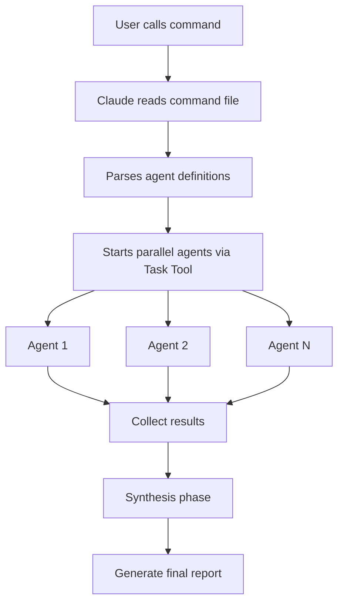
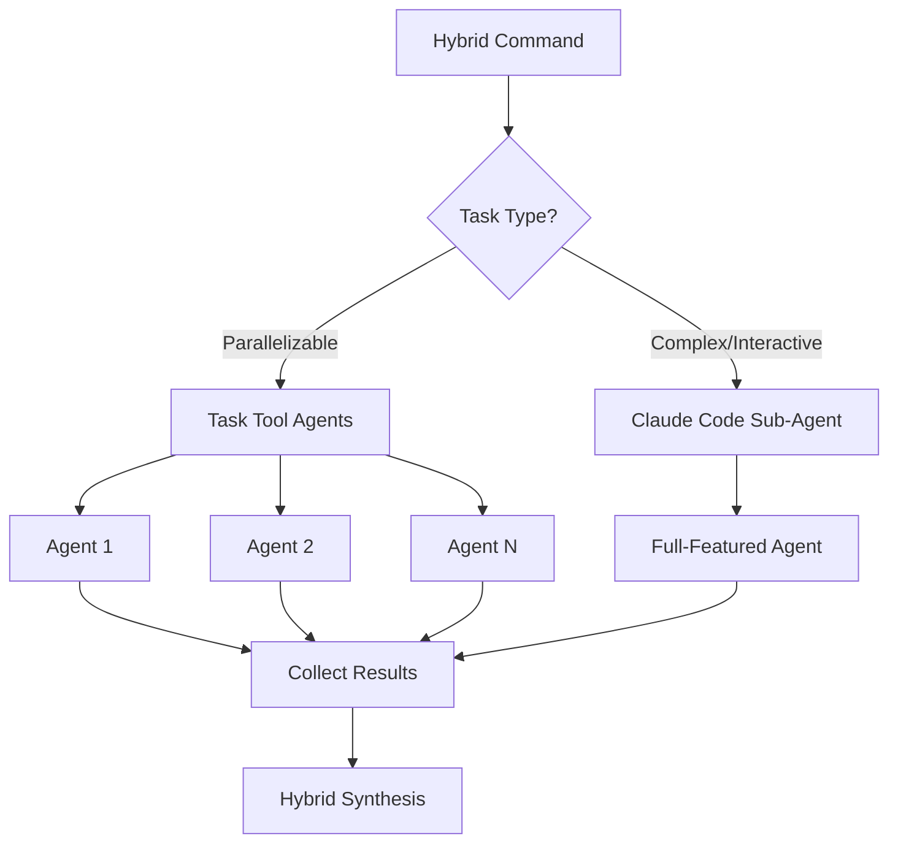

# Technical Guide: Sub-Agent Orchestration System

## Table of Contents

1. [Overview](#overview)
2. [Architecture](#architecture)
3. [For Repository Maintainers](#for-repository-maintainers)
4. [For End Users](#for-end-users)
5. [Configuration in Detail](#configuration-in-detail)
6. [Creating Custom Commands](#creating-custom-commands)
7. [Performance Optimization](#performance-optimization)
8. [Hybrid Architecture](#hybrid-architecture)
9. [Troubleshooting](#troubleshooting)

## Overview

The Sub-Agent Orchestration System enables Claude Code to execute multiple specialized agents in parallel, achieving 5-10x performance improvements for complex analysis tasks. Instead of processing tasks sequentially, the system uses Claude's Task Tool to spawn multiple agents that work simultaneously.

### Core Components

1. **Commands** (`/commands/`): Markdown files with agent orchestration instructions
2. **Configuration** (`.claude-commands.json`): System-wide and command-specific settings
3. **Helper Scripts** (`/scripts/`): Tools for creating and managing commands
4. **Templates** (`/commands/templates/`): Starting points for new commands

## Architecture

### How It Works



### Command Structure

Each command file contains:

```markdown
---
allowed-tools: Task, Read, Grep, Bash(fd:*), Bash(rg:*)
description: Brief description for command listing
argument-hint: [expected-arguments]
---

# Command execution instructions
```

The frontmatter defines:

- `allowed-tools`: Available tools for agents
- `description`: Appears in command lists
- `argument-hint`: Helps with auto-completion

### Agent Definition Pattern

```markdown
1. **Agent Name**: Task(
   description="Brief task description",
   prompt="Detailed instructions for the agent...",
   subagent_type="general-purpose"
   )
```

## For Repository Maintainers

### Directory Structure

```text
claude-code-toolkit/
├── .claude-commands.json          # Global configuration
├── commands/
│   ├── orchestration/            # Analysis & performance commands
│   │   ├── analyze-parallel.md
│   │   ├── security-audit.md
│   │   └── ...
│   ├── research/                 # Research & investigation commands
│   │   ├── deep-dive.md
│   │   └── ...
│   └── templates/                # Command templates
│       ├── basic-sub-agent.md
│       └── ...
└── scripts/
    ├── create-sub-agent-command.sh  # Command generator
    └── update-readme.sh             # Documentation updater
```

### Configuration File: `.claude-commands.json`

The configuration file controls system behavior:

```json
{
  "subAgentOrchestration": {
    "enabled": true,
    "performanceMode": "balanced", // conservative|balanced|aggressive

    "defaults": {
      "tokenBudget": 3000, // Tokens per agent
      "timeout": 30000, // Milliseconds
      "maxRetries": 2,
      "parallelExecution": true
    },

    "commandOverrides": {
      "orchestration:security-audit": {
        "performanceMode": "conservative" // Override for specific command
      }
    }
  }
}
```

### Adding New Commands

1. **Using the helper script** (recommended):

   ```bash
   ./scripts/create-sub-agent-command.sh \
     --name "my-analysis" \
     --agents 8 \
     --category orchestration \
     --description "Custom analysis with 8 agents"
   ```

2. **Manual creation**:

   - Copy template from `/commands/templates/`
   - Adjust agent count and prompts
   - Save in appropriate category folder

3. **Update documentation**:

   ```bash
   ./scripts/update-readme.sh
   ```

### Performance Modes Explained

| Mode         | Max Agents | Token Budget | Timeout | Use Case             |
| ------------ | ---------- | ------------ | ------- | -------------------- |
| Conservative | 5          | 2000         | 20s     | Limited resources    |
| Balanced     | 10         | 3000         | 30s     | Standard, most tasks |
| Aggressive   | 20         | 4000         | 45s     | Large codebases      |

## For End Users

### Installation

```bash
# Installation with default "global" prefix
curl -fsSL https://raw.githubusercontent.com/username/repo/main/install.sh | bash -s -- global

# Custom prefix
curl -fsSL https://raw.githubusercontent.com/username/repo/main/install.sh | bash -s -- myprefix
```

### Using Commands

Commands follow the pattern: `/prefix:category:command`

```bash
# Examples
/global:orchestration:analyze-parallel src/
/global:orchestration:security-audit --severity=critical
/global:research:deep-dive "authentication patterns"
```

### Command Categories

**Orchestration Commands** - Code analysis and quality checks:

- `analyze-parallel`: 10 agents for comprehensive code analysis
- `security-audit`: 8 agents for security vulnerability scanning
- `refactor-impact`: 6 agents for assessing refactoring consequences
- `test-coverage`: 5 agents for test quality analysis
- `performance-scan`: 7 agents for performance profiling

**Research Commands** - Investigation and documentation:

- `deep-dive`: 8 agents for multi-perspective research
- `codebase-map`: 10 agents for mapping entire codebase structure
- `dependency-trace`: 6 agents for dependency analysis

### Understanding Output

Commands typically produce:

1. **Executive Summary**: High-level insights
2. **Detailed Analysis**: Category-specific results
3. **Action Items**: Prioritized next steps
4. **Metrics**: Performance and quality values

## Configuration in Detail

### Project-Level Configuration

Create `.claude-commands.json` in project root:

```json
{
  "subAgentOrchestration": {
    "performanceMode": "aggressive", // Overrides global default
    "synthesis": {
      "format": "json", // json|markdown|csv
      "prioritization": "severity" // severity|impact|effort
    }
  }
}
```

### Command-Specific Overrides

In `.claude-commands.json`:

```json
{
  "commandOverrides": {
    "orchestration:security-audit": {
      "performanceMode": "conservative",
      "synthesis": {
        "prioritization": "cvss-score"
      }
    }
  }
}
```

### Environment Variables

```bash
# Override performance mode
export CLAUDE_PERFORMANCE_MODE=conservative

# Enable debug logging
export CLAUDE_DEBUG=true

# Set custom cache directory
export CLAUDE_CACHE_DIR=~/my-cache
```

## Creating Custom Commands

### Using `create-sub-agent-command.sh`

The helper script simplifies command creation:

```bash
# Basic usage
./scripts/create-sub-agent-command.sh --name "my-command" --agents 6

# All options
./scripts/create-sub-agent-command.sh \
  --name "api-analyzer" \
  --agents 8 \
  --category orchestration \
  --template analysis \
  --description "Analyzes API design patterns"
```

Options:

- `-n, --name`: Command name (required)
- `-a, --agents`: Number of agents (2-20, default: 5)
- `-c, --category`: orchestration|research|custom
- `-t, --template`: basic|analysis|research
- `-d, --description`: Brief description

### Manual Command Creation

1. **Choose template**:

   - `basic-sub-agent.md`: General purpose
   - `analysis-sub-agent.md`: Code analysis focus
   - `research-sub-agent.md`: Research and documentation

2. **Define agents**:

   ```markdown
   1. **Specific Task Agent**: Task(
      description="Analyze specific aspect",
      prompt="Detailed instructions including: 1) What to analyze 2) Tools to use (rg, fd, etc.) 3) Output format (JSON/Markdown)
      Return structured results.",
      subagent_type="general-purpose"
      )
   ```

3. **Design synthesis logic**:
   - How results are merged
   - Deduplication strategy
   - Priority calculation
   - Report generation

### Best Practices

1. **Agent Design**:

   - Focus agents on single responsibilities
   - Give clear output format instructions
   - Include specific tool usage hints
   - Set reasonable token budgets

2. **Performance**:

   - Start with fewer agents, scale as needed
   - Use `conservative` mode for large files
   - Monitor token usage with metrics

3. **Error Handling**:
   - Plan for partial failures
   - Build in fallback strategies
   - Log important errors

## Performance Optimization

### Optimizing Agent Count

```text
Agents | Use Case
-------|---------------
2-4    | Simple, focused analysis
5-8    | Standard code analysis
9-12   | Comprehensive reviews
13-20  | Large codebase analysis
```

### Token Budget Management

```json
{
  "defaults": {
    "tokenBudget": 3000 // Per agent
  }
}
```

Guidelines:

- Simple analysis: 1500-2000 tokens
- Standard tasks: 2500-3500 tokens
- Complex research: 3500-5000 tokens

### Caching Strategy

Enable caching for repeated analyses:

```json
{
  "caching": {
    "enabled": true,
    "ttl": 3600, // 1 hour
    "cacheLocation": "~/.claude/cache/sub-agents"
  }
}
```

## Hybrid Architecture

### Overview

The Hybrid Architecture combines the power of the Task Tool for parallel agent orchestration with the flexibility of Claude Code Sub-Agents. This approach allows leveraging the best of both worlds: the performance benefits of parallel execution and the advanced capabilities of Claude Code for complex, interactive tasks.

### The Hybrid Approach

#### Combining Task Tool and Claude Code Sub-Agents

The Hybrid Architecture uses two complementary approaches:

1. **Task Tool Agents**: For parallelizable, well-defined tasks

   - Fast, parallel execution
   - Limited tool palette
   - Ideal for analysis, search, and structured data processing

2. **Claude Code Sub-Agents**: For complex, interactive tasks
   - Full access to all Claude Code tools
   - Sequential but powerful processing
   - Ideal for code generation, complex refactorings, and interactive workflows



### Configuration for hybridMode

#### Global Configuration in `.claude-commands.json`

```json
{
  "subAgentOrchestration": {
    "enabled": true,
    "hybridMode": {
      "enabled": true,
      "strategy": "adaptive", // adaptive|manual|threshold
      "thresholds": {
        "complexity": 0.7, // Threshold for automatic sub-agent usage
        "fileCount": 50, // File count for sub-agent activation
        "codebaseSize": "10MB" // Codebase size for sub-agent usage
      },
      "fallbackBehavior": "degrade-gracefully" // fail|degrade-gracefully|force-sequential
    },

    "agentCapabilities": {
      "taskAgents": {
        "maxParallel": 10,
        "allowedTools": ["Read", "Grep", "Bash(fd:*)", "Bash(rg:*)"],
        "tokenBudget": 3000
      },
      "subAgents": {
        "maxSequential": 3,
        "allowedTools": "all", // Full tool access
        "tokenBudget": 8000,
        "interactionMode": "autonomous" // autonomous|guided
      }
    }
  }
}
```

#### Command-Specific Hybrid Configuration

```json
{
  "commandOverrides": {
    "orchestration:hybrid-refactor": {
      "hybridMode": {
        "strategy": "manual",
        "agentDistribution": {
          "analysis": "task", // Analysis phase with Task Agents
          "implementation": "sub", // Implementation with Sub-Agents
          "validation": "task" // Validation again with Task Agents
        }
      }
    }
  }
}
```

### Creating Hybrid Commands

#### 1. Basic Hybrid Command Structure

```markdown
---
allowed-tools: Task, Read, Grep, Bash, Edit, Write, MultiEdit
description: Hybrid analysis with automatic agent selection
argument-hint: [target-directory] [options]
hybrid-mode: true
---

# Hybrid Command Execution

## Phase 1: Parallel Analysis (Task Agents)

Analyze the codebase with specialized Task Agents:

1. **Structure Analyzer**: Task(
   description="Analyze project structure",
   prompt="Use fd and rg to understand the architecture...",
   subagent_type="general-purpose"
   )

2. **Pattern Detector**: Task(
   description="Detect code patterns",
   prompt="Search for common patterns and anti-patterns...",
   subagent_type="general-purpose"
   )

## Phase 2: Complex Processing (Claude Code Sub-Agent)

Based on analysis results, perform complex operations:

3. **Refactoring Agent**: SubAgent(
   description="Perform identified refactorings",
   prompt="Use the analysis results to: 1) Refactor code 2) Adapt tests 3) Update documentation
   Use Edit/MultiEdit for changes.",
   capabilities="full-claude-code"
   )

## Phase 3: Validation (Task Agents)

4. **Test Runner**: Task(
   description="Run tests and validate changes",
   prompt="Use Bash to execute tests...",
   subagent_type="general-purpose"
   )
```

#### 2. Adaptive Hybrid Command

```markdown
---
hybrid-mode: adaptive
adaptive-rules:
  - condition: "fileCount > 100"
    use: "task-agents"
  - condition: "requiresCodeGeneration"
    use: "sub-agent"
---

# Adaptive Hybrid Workflow

The system automatically selects the optimal agent type based on:

- Number of files to process
- Complexity of required operations
- Available system resources
```

### Migrating from Task-based to Hybrid Commands

#### Step 1: Analyze Existing Command

```bash
# Analyze existing task-based commands
grep -l "Task(" commands/orchestration/*.md | while read file; do
  echo "Analyzing: $file"
  # Check for complexity and possible sub-agent candidates
done
```

#### Step 2: Identify Hybrid Candidates

Criteria for hybrid migration:

- Commands with code generation or modification
- Workflows with multiple sequential phases
- Tasks that might need user interaction
- Commands that would benefit from extended tool capabilities

#### Step 3: Gradual Migration

```markdown
<!-- Original Task-only Command -->

1. **Analyzer**: Task(
   description="Analyze and modify code",
   prompt="Find patterns and suggest changes...",
   )

<!-- Migrated Hybrid Version -->

1. **Analyzer**: Task(
   description="Analyze code patterns",
   prompt="Find patterns and create change list...",
   )

2. **Modifier**: SubAgent(
   description="Implement suggested changes",
   prompt="Use the analysis results to modify code...",
   capabilities="full-claude-code"
   )
```

#### Step 4: Test and Validate

```bash
# Test script for hybrid migration
./scripts/test-hybrid-command.sh \
  --original "commands/orchestration/old-command.md" \
  --hybrid "commands/orchestration/new-hybrid-command.md" \
  --test-cases "test/cases/hybrid-migration.json"
```

### Best Practices for Hybrid Development

#### 1. Agent Type Selection

**Use Task Agents for:**

- Parallel file search and analysis
- Pattern detection across many files
- Metrics collection and reporting
- Read-only operations

**Use Claude Code Sub-Agents for:**

- Code generation and modification
- Complex multi-file refactorings
- Interactive debugging sessions
- Tasks with conditional logic

#### 2. Performance Optimization

```json
{
  "hybridOptimization": {
    "pipelineStrategy": "streaming", // streaming|batch|adaptive
    "memoryManagement": {
      "shareContextBetweenPhases": true,
      "maxContextSize": "50MB",
      "compressionEnabled": true
    },
    "executionHints": {
      "preferParallelWhenPossible": true,
      "subAgentPooling": true,
      "reuseAnalysisResults": true
    }
  }
}
```

#### 3. Error Handling in Hybrid Environments

````markdown
## Error Handling Strategy

1. **Graceful Degradation**:

   - If sub-agents fail, fall back to task agents
   - Accept partial results and continue

2. **Rollback Mechanisms**:

   - Encapsulate sub-agent changes in transactions
   - Automatic rollback on validation errors

3. **Hybrid-specific Logging**:
   ```json
   {
     "logging": {
       "hybridEvents": true,
       "agentTransitions": true,
       "performanceMetrics": {
         "compareAgentTypes": true,
         "trackSwitchingOverhead": true
       }
     }
   }
   ```
````

````

#### 4. Advanced Hybrid Patterns

**Pattern 1: Analysis-Modification-Validation**
```markdown
Phase 1: Parallel Analysis (Task Agents) →
Phase 2: Targeted Modification (Sub-Agent) →
Phase 3: Parallel Validation (Task Agents)
````

**Pattern 2: Progressive Enhancement**

```markdown
Basic Analysis (Task) →
If complex: Deep Analysis (Sub-Agent) →
Optimization (Task)
```

**Pattern 3: Fail-Safe Hybrid**

```markdown
Try parallel execution (Task) →
On timeout/error: Sequential with Sub-Agent →
Consolidate results
```

#### 5. Metrics and Monitoring

```json
{
  "hybridMetrics": {
    "track": [
      "agentTypeDistribution",
      "switchingFrequency",
      "performanceComparison",
      "resourceUtilization"
    ],
    "reporting": {
      "compareBaselines": true,
      "showHybridAdvantage": true,
      "identifyBottlenecks": true
    }
  }
}
```

### Summary

The Hybrid Architecture provides maximum flexibility and performance through intelligent combination of Task Tools and Claude Code Sub-Agents. Through careful configuration and thoughtful command design, developers can create commands that automatically choose the optimal execution strategy for each task.

## Troubleshooting

### Common Issues

#### "Token limit exceeded"

- Reduce `tokenBudget` in configuration
- Use fewer agents
- Switch to `conservative` performance mode

#### "Agent timeout"

- Increase timeout in configuration
- Reduce task complexity
- Check for infinite loops in prompts

#### "Synthesis failed"

- Check if all agents return expected format
- Look for JSON parsing errors
- Enable debug logging

### Debug Mode

Enable detailed logging:

```bash
export CLAUDE_DEBUG=true
export CLAUDE_LOG_LEVEL=debug
```

### Performance Metrics

Monitor command performance:

```json
{
  "metrics": {
    "trackPerformance": true,
    "logLocation": "~/.claude/logs/sub-agent-metrics.log"
  }
}
```

Captured metrics:

- Execution time per agent
- Token usage
- Success/failure rates
- Speedup factor vs. sequential

### Getting Help

1. Check command-specific documentation
2. Review agent outputs for errors
3. Examine metric logs
4. Submit issues with:
   - Command used
   - Error messages
   - Performance metrics
   - Configuration settings
