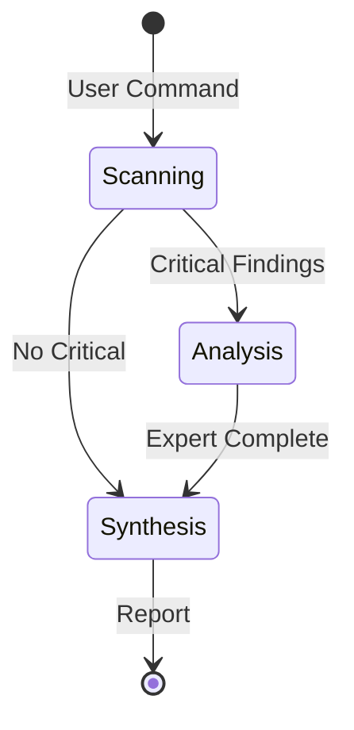

# Technical Guide

## System Components

### 1. Commands (`/commands/`)

Markdown files with YAML frontmatter defining reusable operations.

```yaml
---
description: Brief description
argument-hint: [args] [--options]
allowed-tools: Task, Read, Grep, Bash(cmd:*)
mcp-enhanced: mcp__tool1, mcp__tool2
---

# Command implementation
```

### 2. Agents (`/agents/`)

Specialized AI personas with domain expertise.

```yaml
---
name: agent-identifier  # REQUIRED
description: Agent purpose  # REQUIRED
mcp-enhanced: mcp__tools  # OPTIONAL
---

# Agent persona and instructions
```

### 3. Configuration (`.claude-commands.json`)

```json
{
  "version": "3.0.0",
  "subAgentOrchestration": {
    "enabled": true,
    "performanceMode": "balanced",
    "defaults": {
      "tokenBudget": 3000,
      "timeout": 30000,
      "parallelExecution": true
    }
  }
}
```

## Command Development

### Creating Commands

#### Using Helper Script

```bash
./scripts/create-sub-agent-command.sh \
  --name "command-name" \
  --agents 8 \
  --category scan
```

#### Manual Creation

1. Copy template from `/commands/templates/`
2. Define agent tasks and prompts
3. Implement synthesis logic
4. Test with small dataset

### Command Patterns

#### Parallel Analysis

```markdown
**START N PARALLEL AGENTS:**

1. **Scanner**: Task(
   description="Focus area",
   prompt="Instructions with output format",
   subagent_type="general-purpose"
)
```

#### Conditional Delegation

```markdown
If severity >= high:
  Delegate to @specialist:
  "Analyze: [findings]"
```

#### Synthesis

```markdown
## Combine Results
- Deduplicate findings
- Prioritize by severity
- Generate unified report
```

## Agent Orchestration

### Task Tool Mechanics

The Task Tool enables parallel execution:

```javascript
// Pseudo-implementation
async function executeCommand(agents) {
  const results = await Promise.all(
    agents.map(agent => TaskTool.execute(agent))
  );
  return synthesize(results);
}
```

### Token Budget Optimization

| Strategy | Implementation |
|----------|---------------|
| **Focused Prompts** | Specific instructions, clear boundaries |
| **Structured Output** | JSON for machines, Markdown for humans |
| **Context Minimization** | Only essential information per agent |

### Performance Tuning

```json
{
  "performanceMode": "aggressive",
  "optimization": {
    "maxConcurrentAgents": 20,
    "tokenBudget": 4000,
    "timeout": 45000,
    "caching": true
  }
}
```

## Hybrid Architecture Implementation

### Phase Orchestration



### Agent Selection Logic

```javascript
function selectAgentType(task) {
  if (task.isParallelizable && !task.requiresModification) {
    return 'task-agent';
  }
  if (task.complexity > 0.7 || task.requiresContext) {
    return 'sub-agent';
  }
  return 'task-agent';
}
```

### Delegation Strategy

```json
{
  "delegationStrategy": {
    "automatic": true,
    "rules": [
      {"condition": "severity >= critical", "delegate": "security-specialist"},
      {"condition": "complexity > 0.8", "delegate": "code-architect"},
      {"condition": "performance.impact > 50", "delegate": "performance-optimizer"}
    ]
  }
}
```

## Installation & Deployment

### Installation Process

```bash
# The install.sh script:
1. Validates environment
2. Creates ~/.claude/ structure
3. Copies commands to ~/.claude/commands/[prefix]/
4. Installs agents to ~/.claude/agents/
5. Sets up configuration
```

### Directory Mapping

| Source | Target |
|--------|--------|
| `/commands/*` | `~/.claude/commands/[prefix]/*` |
| `/agents/*` | `~/.claude/agents/*` |
| `/hooks/*` | `~/.claude/claude-code-toolkit/hooks/*` |

### Multi-Environment Setup

```bash
# Development
./install.sh dev --use-symlinks

# Staging
./install.sh stage --components="scan,test"

# Production
./install.sh prod --with-settings
```

## Error Handling

### Common Issues & Solutions

| Error | Cause | Solution |
|-------|-------|----------|
| `Token limit exceeded` | High agent count/budget | Reduce agents or use conservative mode |
| `Agent timeout` | Complex task | Increase timeout or simplify |
| `Command not found` | Installation issue | Check `~/.claude/commands/PREFIX/` |
| `Synthesis failed` | Output format mismatch | Ensure consistent JSON/Markdown |

### Debug Configuration

```json
{
  "debug": {
    "enabled": true,
    "logLevel": "verbose",
    "captureMetrics": true,
    "outputPath": "~/.claude/logs/"
  }
}
```

### Error Recovery

```javascript
try {
  const results = await executeAgents(tasks);
  return synthesize(results);
} catch (error) {
  if (error.type === 'TIMEOUT') {
    return partialResults();
  }
  if (error.type === 'TOKEN_LIMIT') {
    return fallbackToSequential();
  }
  throw error;
}
```

## Performance Optimization

### Metrics Collection

```json
{
  "metrics": {
    "track": ["execution_time", "token_usage", "success_rate"],
    "reporting": {
      "format": "json",
      "destination": "~/.claude/metrics/",
      "interval": "per_command"
    }
  }
}
```

### Optimization Strategies

| Level | Strategy | Impact |
|-------|----------|--------|
| **Agent** | Minimize context, focused prompts | 30% token reduction |
| **Command** | Optimal agent count | 2-5x speedup |
| **System** | Caching, pooling | 20% latency reduction |

### Benchmarking

```bash
# Performance test
time /prefix:scan:deep . --performance-metrics

# Output
Real: 6.2s
Agents: 10
Sequential estimate: 52s
Speedup: 8.4x
Token efficiency: 2,845/agent
```

## Advanced Configuration

### Custom Agent Capabilities

```json
{
  "agentCapabilities": {
    "taskAgents": {
      "maxParallel": 15,
      "allowedTools": ["Read", "Grep", "Bash"],
      "tokenBudget": 3500
    },
    "subAgents": {
      "maxSequential": 3,
      "allowedTools": "all",
      "tokenBudget": 8000
    }
  }
}
```

### Pipeline Configuration

```json
{
  "pipeline": {
    "stages": [
      {"name": "scan", "type": "parallel", "agents": 10},
      {"name": "analyze", "type": "conditional", "threshold": 0.7},
      {"name": "report", "type": "synthesis"}
    ]
  }
}
```

## Testing & Validation

### Command Testing

```bash
# Dry run
/prefix:command --dry-run

# Limited scope
/prefix:command --test-files="sample/*"

# Validation mode
/prefix:command --validate-only
```

### Agent Testing

```markdown
## Test Cases
1. Single file analysis
2. Large codebase (1000+ files)
3. Token limit scenarios
4. Timeout conditions
5. Error recovery
```

## Security Considerations

### Tool Access Control

```yaml
# Restrictive
allowed-tools: Read, Grep

# Moderate
allowed-tools: Read, Grep, Bash(git:*), Bash(npm:view)

# Permissive (use carefully)
allowed-tools: Task, Read, Write, Edit, Bash
```

### Sandboxing

- Agents run in isolated contexts
- No persistent state between executions
- File system access controlled by `allowed-tools`

---

*For architecture overview, see [System Architecture](SYSTEM-ARCHITECTURE.md)*  
*For hybrid details, see [Hybrid Architecture](HYBRID-ARCHITECTURE.md)*
