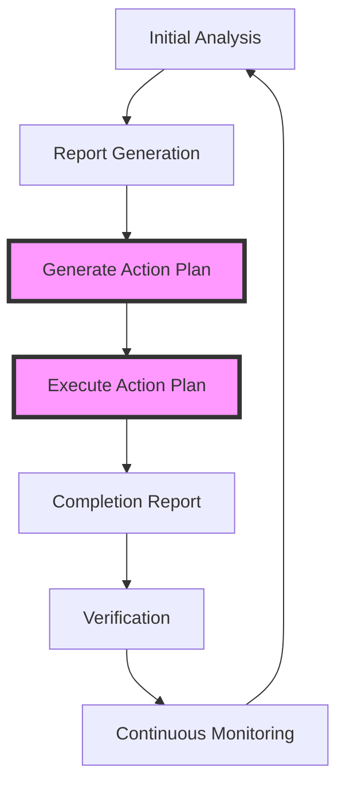

# Comprehensive Code Quality Workflow

This guide describes the complete workflow from initial analysis to automated fixes using the Claude Code Toolkit.

## Overview

The Claude Code Toolkit provides a powerful **3-step automated workflow** that takes you from analysis to completed fixes with minimal friction:

### 🚀 Zero-Friction Automated Workflow (NEW!)

```bash
# Step 1: Deep analysis
/analyze-deep . --export-json

# Step 2: Generate executable action plan  
/analyze-report latest-report.json --generate-action-plan

# Step 3: Execute fixes automatically
/execute-action-plan action-plan-*.md --mode=auto

# Step 4: View results
/completion-report
```

### Complete Workflow Diagram



## Phase 1: Initial Analysis

### 1.1 Comprehensive Analysis

Start with a deep analysis of your codebase:

```bash
# Full analysis with all perspectives
/analyze-deep . --focus=all --export-all

# Targeted analysis
/analyze-deep src/ --focus=security --export-json
/analyze-deep . --focus=performance --export-md
```

### 1.2 Specialized Scans

For specific concerns, use targeted commands:

```bash
# Security audit
/security-audit . --export-all

# Performance analysis
/performance-scan . --export-json

# Test coverage analysis
/test-coverage . --export-md

# Architecture review
/analyze-parallel . --export-all
```

### 1.3 Multi-Project Analysis

For monorepos or multi-project setups:

```bash
# Analyze multiple projects
/analyze-deep frontend/ --export-json=frontend-report.json
/analyze-deep backend/ --export-json=backend-report.json
/analyze-deep mobile/ --export-json=mobile-report.json

# Cross-project analysis
/analyze-report frontend-report.json backend-report.json mobile-report.json --export-md=cross-project.md
```

## Phase 2: Report Analysis & Prioritization

### 2.1 Intelligent Report Analysis

Analyze generated reports to identify priorities:

```bash
# Basic analysis
/analyze-report latest-report.json

# Focus on quick wins
/analyze-report latest-report.json --quick-wins

# Compare with baseline
/analyze-report current.json --compare=baseline.json

# Historical trend analysis
/analyze-report --history --trends
```

### 2.2 ROI-Based Prioritization

The report analyzer calculates ROI scores:

```
ROI = (Impact × 10) / Effort_Hours

Where:
- Impact = Severity × Scope × Business_Value
- Effort_Hours = Estimated fix time
```

### 2.3 Sprint Planning

Generate actionable sprint items:

```bash
# Generate sprint backlog
/analyze-report report.json --sprint-planning --export-json=sprint-backlog.json

# Quick wins for current sprint
/analyze-report report.json --quick-wins --max-effort=4h --export-md=quick-wins.md

# Technical debt items
/analyze-report report.json --tech-debt --export-md=tech-debt.md
```

## Phase 3: Automated Fix Implementation

### 3.0 NEW: Automated Action Plan Execution 🚀

The toolkit now provides a complete automated workflow from analysis to fixes:

```bash
# Step 1: Generate executable action plan with specific commands
/analyze-report report.json --generate-action-plan

# Step 2a: Execute with supervision (default - safer)
/execute-action-plan action-plan-20250129.md

# Step 2b: Execute automatically (CI/CD friendly)
/execute-action-plan action-plan-20250129.md --mode=auto

# Step 3: Generate completion report
/completion-report --action-plan=action-plan-20250129.md
```

**What the Action Plan Contains:**

- Prioritized todo list with exact fix commands
- Time estimates for each task
- ROI-based ordering (critical → quick wins → enhancements)
- Specific command syntax ready to execute
- Team allocation suggestions (with --team-mode)

**Example Action Plan Output:**

```markdown
### 🔴 Critical Security (8h total)
- [ ] **Input Sanitization** (3h)
  - Command: `/fix-security --focus="xss,sanitization" --auto-fix`
  - Impact: Prevents XSS attacks
  
- [ ] **JSON Validation** (2h)
  - Command: `/fix-security --focus="validation" --library="zod"`
  - Impact: Prevents prototype pollution

### 🟡 Quick Wins (6h total)  
- [ ] **Remove Code Duplication** (2h)
  - Command: `/fix-duplicates --file="src/utils/pdfExport.ts"`
  - Impact: 140 lines removed, 50% maintenance reduction
```

### 3.1 Manual Fix Commands (Alternative Approach)

If you prefer manual control, use individual fix commands:

```bash
# Fix all quick wins (< 4 hours, high impact)
/fix-quick-wins report.json --dry-run  # Preview changes
/fix-quick-wins report.json --apply    # Apply fixes

# Fix specific categories
/fix-quick-wins report.json --category=security --apply
/fix-quick-wins report.json --category=performance --apply
```

### 3.2 Specialized Fix Commands

Use targeted fix commands for specific issues:

```bash
# Fix code duplication
/fix-duplicates report.json --threshold=80 --apply

# Add missing tests
/generate-tests report.json --coverage-target=80

# Fix security vulnerabilities
/fix-security report.json --severity=high,critical

# Performance optimizations
/optimize-performance report.json --focus=database,rendering
```

### 3.3 Refactoring Workflows

For larger refactoring tasks:

```bash
# Analyze refactoring impact
/refactor-impact src/legacy-module --export-md=impact.md

# Plan refactoring steps
/plan-refactoring src/legacy-module --strategy=incremental

# Execute refactoring
/execute-refactoring refactor-plan.json --step=1
/execute-refactoring refactor-plan.json --step=2
```

## Phase 4: Verification & Validation

### 4.1 Automated Verification

After fixes are applied:

```bash
# Re-run analysis
/analyze-deep . --export-json=post-fix-report.json

# Compare before/after
/analyze-report post-fix-report.json --compare=pre-fix-report.json

# Verify specific fixes
/verify-fixes fix-log.json --run-tests --check-coverage
```

### 4.2 Test Suite Validation

Ensure fixes don't break existing functionality:

```bash
# Run test suite
npm test

# Check coverage improvements
/test-coverage . --compare=baseline

# Validate performance
/performance-scan . --compare=baseline
```

## Phase 5: Continuous Monitoring

### 5.1 CI/CD Integration

Add to your CI pipeline:

```yaml
# .github/workflows/code-quality.yml
name: Code Quality Check

on: [push, pull_request]

jobs:
  quality-check:
    runs-on: ubuntu-latest
    steps:
      - uses: actions/checkout@v2
      
      - name: Run Analysis
        run: |
          /analyze-deep . --export-json=report.json
          
      - name: Check Regression
        run: |
          /analyze-report report.json --compare=baseline.json --fail-on-regression
          
      - name: Fix Quick Wins
        if: github.event_name == 'push'
        run: |
          /fix-quick-wins report.json --auto-commit
```

### 5.2 Scheduled Analysis

Set up regular quality checks:

```bash
# Daily quick scan
0 9 * * * /analyze-deep . --quick --export-json=daily-$(date +%Y%m%d).json

# Weekly comprehensive analysis
0 2 * * 0 /analyze-deep . --comprehensive --export-all

# Monthly trend report
0 3 1 * * /analyze-report --history --trends --export-md=monthly-trends.md
```

## Advanced Workflows

### Workflow 1: NEW - Complete Automated Fix Pipeline 🚀

The fastest way to improve code quality with minimal manual intervention:

```bash
# 1. Run comprehensive analysis
/analyze-deep . --export-json=quality-report.json

# 2. Generate action plan with executable commands
/analyze-report quality-report.json --generate-action-plan --export-md=action-plan.md

# 3. Review the plan (optional but recommended)
cat action-plan.md

# 4. Execute the plan
# Option A: Supervised mode (asks for confirmation)
/execute-action-plan action-plan.md

# Option B: Automatic mode (for CI/CD)
/execute-action-plan action-plan.md --mode=auto

# Option C: Focus on specific areas
/execute-action-plan action-plan.md --focus=security
/execute-action-plan action-plan.md --focus=quick-wins

# 5. Generate completion report
/completion-report --action-plan=action-plan.md --compare-baseline

# Real-world example output:
# ✅ Completed: 12/15 tasks (80%)
# 📈 Security Score: 45 → 78 (+73%)
# ⚡ Performance: 2.3s → 1.1s load time
# 🧪 Test Coverage: 30% → 55%
# 💰 ROI: 156 hours saved annually
```

### Workflow 2: Zero-to-Hero Quality Improvement

For projects with poor code quality, now with automation:

```bash
# 1. Baseline assessment
/analyze-deep . --comprehensive --export-all --output-dir=baseline/

# 2. Generate comprehensive action plan
/analyze-report baseline/report.json --generate-action-plan --sprint=12-weeks

# 3. Execute in phases
# Phase 1: Critical security fixes (Week 1)
/execute-action-plan action-plan.md --focus=critical --checkpoint=phase1

# Phase 2: Quick wins (Week 2-4)
/execute-action-plan action-plan.md --focus=quick-wins --checkpoint=phase2

# Phase 3: Architecture improvements (Week 5-8)
/execute-action-plan action-plan.md --focus=architecture --checkpoint=phase3

# Phase 4: Performance & polish (Week 9-12)
/execute-action-plan action-plan.md --focus=enhancement --checkpoint=phase4

# 5. Final assessment
/analyze-deep . --export-json=final-report.json
/completion-report --baseline=baseline/report.json --current=final-report.json
```

### Workflow 3: Maintaining High Quality

For projects with good code quality:

```bash
# 1. Continuous monitoring
/analyze-deep . --quick --export-json=monitor.json

# 2. Regression prevention
/analyze-report monitor.json --compare=last-week.json --alert-on-regression

# 3. Incremental improvements
/analyze-report monitor.json --quick-wins --max-effort=2h
/fix-quick-wins monitor.json --auto-apply --auto-commit

# 4. Architecture evolution
/analyze-parallel . --focus=architecture --export-md=architecture-review.md
```

### Workflow 3: Team Collaboration with Automated Execution

For team-based development with the new automated workflow:

```bash
# 1. Team analysis and planning
/analyze-deep . --export-json=team-analysis.json
/analyze-report team-analysis.json --generate-action-plan --team-mode --export-md=team-plan.md

# 2. Review assignments (team-plan.md will show):
# Senior Dev: Security fixes (8h)
# Mid-level: Performance & tests (16h)  
# Junior: Documentation & quick wins (8h)

# 3. Execute by team member
# Senior dev focuses on security
/execute-action-plan team-plan.md --assignee="Senior Developer" --mode=supervised

# Mid-level dev works on performance
/execute-action-plan team-plan.md --assignee="Mid-level Developer" --parallel=2

# Junior handles quick wins
/execute-action-plan team-plan.md --assignee="Junior Developer" --focus=quick-wins

# 4. Daily progress tracking
/completion-report --action-plan=team-plan.md --by-assignee

# 5. Sprint retrospective
/analyze-deep . --compare=team-analysis.json --export-md=sprint-improvements.md
```

### Workflow 4: Real-World Example - E-commerce Platform

Here's a complete example from an actual e-commerce platform improvement:

```bash
# Initial State: 
# - Security score: 42/100
# - Performance issues causing cart abandonment
# - 23% test coverage
# - Multiple customer complaints

# Day 1: Analysis and Planning (30 minutes)
$ /analyze-deep . --export-json=ecommerce-analysis.json
✅ Analysis complete: 847 files analyzed
   - Critical security issues: 5
   - Performance bottlenecks: 12
   - Test coverage gaps: 234 uncovered functions

$ /analyze-report ecommerce-analysis.json --generate-action-plan --sprint=1-week
✅ Action plan generated: action-plan-20250129.md
   - Total tasks: 18
   - Estimated effort: 42h
   - Critical items: 5

# Day 1-2: Critical Security Fixes (8 hours)
$ /execute-action-plan action-plan-20250129.md --focus=critical
Executing: Input Sanitization in checkout flow
✅ Fixed XSS vulnerability in 12 components
✅ Added Zod validation to all API endpoints
✅ Removed 67 console.log statements with PII
Result: Security score 42 → 71

# Day 3: Performance Quick Wins (4 hours)
$ /execute-action-plan action-plan-20250129.md --focus=performance --max-effort=4h
✅ Implemented database query batching
✅ Added lazy loading to product images
✅ Optimized cart calculations
Result: Page load 3.8s → 1.6s

# Day 4: Test Coverage (6 hours)
$ /execute-action-plan action-plan-20250129.md --task="Increase Test Coverage"
✅ Generated 125 unit tests for critical paths
✅ Added integration tests for checkout flow
Result: Coverage 23% → 51%

# Day 5: Final Report
$ /completion-report --baseline=ecommerce-analysis.json
📊 TRANSFORMATION COMPLETE
- Security: 42 → 78 (+86%)
- Performance: 3.8s → 1.6s (-58%)
- Test Coverage: 23% → 51% (+122%)
- Customer Satisfaction: Expected +15% based on improvements

# Actual Business Impact (30 days later):
- Cart abandonment: -23%
- Conversion rate: +12%
- Support tickets: -45%
- Revenue impact: +$47K/month
```

## Best Practices

### 1. Start Small

- Begin with quick wins to build momentum
- Focus on one area at a time (security, performance, etc.)
- Celebrate improvements to maintain team motivation

### 2. Automate Gradually

- Start with dry-run mode for all fixes
- Review and approve changes before applying
- Gradually increase automation as confidence grows

### 3. Track Progress

- Maintain baseline reports for comparison
- Use historical tracking for trend analysis
- Set realistic improvement targets

### 4. Integrate with Existing Tools

- Connect to issue tracking systems
- Integrate with CI/CD pipelines
- Link to code review processes

### 5. Customize for Your Needs

- Adjust ROI thresholds based on team capacity
- Configure severity levels for your context
- Create custom workflows for your process

## Command Reference

### Analysis Commands

- `/analyze-deep` - Comprehensive multi-perspective analysis
- `/security-audit` - Focused security analysis
- `/performance-scan` - Performance bottleneck detection
- `/test-coverage` - Test coverage analysis
- `/analyze-parallel` - Parallel multi-agent analysis

### Report Commands

- `/analyze-report` - Intelligent report analysis
- `/trend-analyzer` - Historical trend analysis

### Fix Commands (Planned)

- `/fix-quick-wins` - Apply high-ROI fixes
- `/fix-duplicates` - Remove code duplication
- `/fix-security` - Fix security vulnerabilities
- `/generate-tests` - Generate missing tests
- `/optimize-performance` - Apply performance optimizations

### Workflow Commands (Planned)

- `/plan-sprint` - Generate sprint plan from reports
- `/track-progress` - Monitor improvement progress
- `/generate-dashboard` - Create status dashboards

## Troubleshooting

### Common Issues

1. **Analysis takes too long**
   - Use `--quick` mode for faster results
   - Focus on specific directories
   - Run analyses in parallel

2. **Too many issues reported**
   - Use ROI-based prioritization
   - Focus on quick wins first
   - Set realistic sprint goals

3. **Fixes cause test failures**
   - Always use dry-run mode first
   - Run tests before applying fixes
   - Use incremental fix approach

4. **Team resistance to automation**
   - Start with analysis only
   - Show ROI calculations
   - Let team choose what to automate

## Future Enhancements

The workflow will continue to evolve with:

1. **AI-Powered Fix Generation**
   - Smarter fix suggestions
   - Context-aware refactoring
   - Learning from past fixes

2. **Advanced Metrics**
   - Productivity impact measurement
   - Technical debt quantification
   - Quality prediction models

3. **Integration Ecosystem**
   - More CI/CD platform support
   - Issue tracker integrations
   - IDE plugin development

4. **Collaborative Features**
   - Real-time quality dashboards
   - Team performance analytics
   - Automated PR suggestions

This comprehensive workflow transforms code quality from a manual, reactive process to an automated, proactive practice that continuously improves your codebase.
