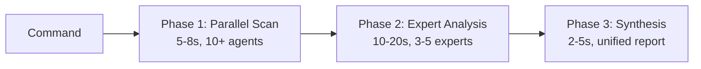

# Architecture Guide

System architecture and design patterns of the Claude Code Toolkit.

## Hybrid Architecture

The toolkit combines parallel scanning with expert analysis for optimal performance:



### Execution Characteristics

| Phase | Method | Agents | Context | Output | Use Case |
|-------|--------|--------|---------|--------|----------|
| **Scan** | Parallel via Task Tool | 10-20 | Minimal, shared | JSON | Broad detection |
| **Analyze** | Sequential Sub-Agents | 3-5 | Deep, isolated | Markdown | Critical findings |
| **Synthesize** | Single coordinator | 1 | All results | Report | Actionable insights |

## Command System

### File Structure
```
commands/{category}/{command}.md
→ /prefix:category:command
```

### Frontmatter Schema
```yaml
---
allowed-tools: Task, Read, Grep, Bash(cmd:*)
description: Command purpose
argument-hint: [args] [--options]
mcp-enhanced: mcp__tool1, mcp__tool2  # Optional
---
```

See [extending.md](extending.md#creating-commands) for creation workflow.

## Agent System

### Agent Types

| Type | Execution | Tools | Token Budget | Purpose |
|------|-----------|-------|--------------|---------|
| **Task Agents** | Parallel (Promise.all) | Limited (Read, Grep) | 2-3K | Fast scanning |
| **Sub-Agents** | Sequential | Full access | 4-5K | Deep analysis |

### Specialized Agents

| Agent | Domain | Trigger Conditions |
|-------|--------|-------------------|
| `security-specialist` | OWASP, CVEs | Security findings > threshold |
| `performance-optimizer` | Bottlenecks, O(n) | Performance impact > 50ms |
| `code-architect` | Patterns, design | Complexity score > 0.8 |
| `test-engineer` | Coverage, quality | Coverage < 60% |
| `refactoring-expert` | Clean code | Duplication > 30% |

## Orchestration Engine

### Task Tool Integration

```javascript
// Parallel execution pattern
const results = await Promise.all(
  agents.map(agent => TaskTool.execute({
    prompt: agent.prompt,
    subagent_type: "general-purpose",
    tokenBudget: config.tokenBudget
  }))
);
```

### Delegation Logic

```javascript
// Automatic expert delegation
if (finding.severity >= "high" || 
    finding.confidence < 0.5 ||
    finding.requiresContext) {
  delegateToExpert(finding);
}
```

## Performance Optimization

### Token Distribution

| Strategy | Implementation | Use Case |
|----------|---------------|----------|
| **Equal** | `budget / agentCount` | Uniform tasks |
| **Weighted** | Based on complexity | Mixed workloads |
| **Dynamic** | Runtime adjustment | Adaptive mode |

### Resource Limits

- Max parallel agents: 20
- Max token budget: 100K total
- Max execution time: 5 minutes
- Max file size: 10MB

## Data Flow

```
Input → Parse → Distribute → Execute → Aggregate → Deduplicate → Synthesize → Export
```

### Export Formats

- **JSON**: Machine-readable results
- **Markdown**: Human-readable reports
- **CSV**: Data analysis
- **HTML**: Web presentation

## Security Model

### Tool Permissions

```yaml
# Restrictive (read-only)
allowed-tools: Read, Grep

# Moderate (analysis + git)
allowed-tools: Read, Grep, Bash(git:*), Bash(npm:view)

# Permissive (full access)
allowed-tools: Task, Read, Write, Edit, Bash
```

### Sandboxing

- Agents run in isolated contexts
- No persistent state between executions
- File system access controlled by `allowed-tools`
- Network access restricted by default

## Extension Points

1. **Commands**: Add to `commands/{category}/`
2. **Agents**: Add to `agents/`
3. **Workflows**: Chain existing commands
4. **Configuration**: Override in project `.claude-commands.json`

## Design Patterns

| Pattern | Usage | Implementation |
|---------|-------|----------------|
| **Command** | Encapsulate requests | Each .md file is a command |
| **Strategy** | Performance modes | Conservative/Balanced/Aggressive |
| **Observer** | Progress tracking | Real-time updates |
| **Factory** | Agent creation | Based on problem type |

## Related Documentation

- [Configuration](configuration.md) - Performance tuning
- [Extending](extending.md) - Creating commands/agents
- [Internals](internals.md) - Implementation details