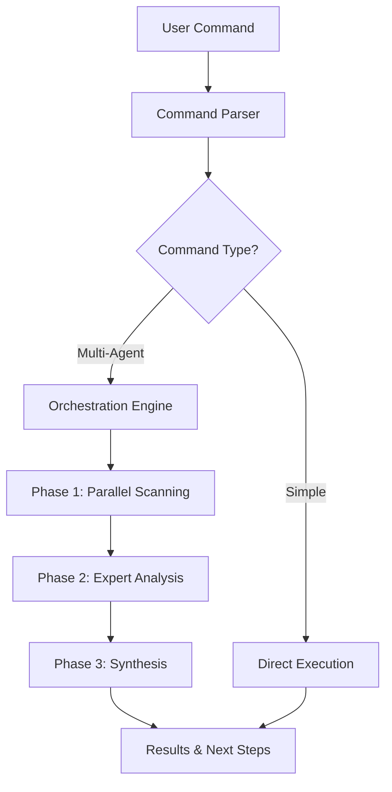

# Architecture Guide

This document describes the technical architecture of the Claude Code Toolkit, including design decisions, patterns, and implementation details.

## 🏗️ System Architecture Overview

The Claude Code Toolkit uses a **Hybrid Architecture** that combines parallel processing capabilities with specialized AI agents for optimal performance and flexibility.



## 🎯 Design Principles

### 1. **Modularity**
- Commands are self-contained Markdown files
- Agents are independent specialists
- Clear separation of concerns

### 2. **Scalability**
- Parallel execution for performance
- Token budget management
- Configurable resource limits

### 3. **Extensibility**
- Template-based command creation
- Plugin-like agent system
- Configuration overrides

### 4. **User-Centric**
- Wizard-like guidance
- Context preservation
- Clear next steps

## 🔧 Core Components

### Command System

#### Structure
```
commands/
├── category/
│   └── command-name.md
```

#### Command File Format
```markdown
---
allowed-tools: Task, Read, Grep, Bash, Write
description: Command description
argument-hint: <args>
---

# Command Implementation

## Phase 1: Analysis
[Task definitions]

## Phase 2: Processing
[Logic and coordination]

## Phase 3: Output
[Results and next steps]
```

#### Command Execution Flow
1. **Parse Command**: Extract category and name
2. **Load Definition**: Read Markdown file
3. **Process Frontmatter**: Extract metadata
4. **Execute Instructions**: Follow command logic
5. **Generate Output**: Structured results

### Agent System

#### Agent Types

1. **Task Agents** (Parallel)
   - Limited tool access
   - Fast, focused execution
   - Used in scanning phases

2. **Sub-Agents** (Sequential)
   - Full Claude Code capabilities
   - Complex analysis
   - Used for deep dives

#### Agent Definition
```markdown
---
name: agent-name
description: Specialization area
---

You are an expert in [domain].

## Core Expertise
- Area 1
- Area 2

## Analysis Approach
[Methodology]

## Output Format
[Structure]
```

### Orchestration Engine

#### Multi-Agent Coordination
```javascript
// Conceptual flow
async function orchestrate(command) {
  // Phase 1: Parallel scanning
  const scanResults = await Promise.all(
    scanners.map(scanner => 
      TaskTool.execute(scanner)
    )
  );
  
  // Phase 2: Expert analysis
  const expertResults = await delegateToExperts(
    scanResults,
    command.experts
  );
  
  // Phase 3: Synthesis
  return synthesize(scanResults, expertResults);
}
```

#### Performance Optimization
- **Parallel Execution**: 5-20 agents simultaneously
- **Token Distribution**: Smart allocation based on complexity
- **Timeout Management**: Prevent hanging operations
- **Result Caching**: Avoid redundant analyses

### Configuration System

#### Hierarchy
1. **Global Configuration**: `.claude-commands.json`
2. **Project Configuration**: Project-specific overrides
3. **Command Configuration**: Per-command settings
4. **Runtime Configuration**: CLI parameters

#### Configuration Schema
```typescript
interface Configuration {
  subAgentOrchestration: {
    enabled: boolean;
    performanceMode: 'conservative' | 'balanced' | 'aggressive';
    defaults: {
      tokenBudget: number;
      timeout: number;
      maxRetries: number;
      parallelExecution: boolean;
    };
    commandOverrides: {
      [commandName: string]: Partial<CommandConfig>;
    };
  };
  hybridMode: {
    enabled: boolean;
    strategy: 'adaptive' | 'manual' | 'threshold';
    agentRegistry: {
      [agentName: string]: AgentConfig;
    };
  };
}
```

## 🚀 The Hybrid Architecture

### Overview

The Hybrid Architecture is the key innovation that enables both speed and depth:

```
┌─────────────────┐     ┌─────────────────┐     ┌─────────────────┐
│   Phase 1       │     │   Phase 2       │     │   Phase 3       │
│ Parallel Scan   │ --> │ Expert Analysis │ --> │   Synthesis     │
│ (5-8 seconds)   │     │ (10-20 seconds) │     │  (2-5 seconds)  │
└─────────────────┘     └─────────────────┘     └─────────────────┘
     10+ agents              3-5 experts            1 synthesizer
```

### Phase 1: Parallel Scanning

**Purpose**: Broad, fast analysis across the codebase

**Implementation**:
```javascript
const scanners = [
  { name: 'Security Scanner', focus: 'vulnerabilities' },
  { name: 'Performance Scanner', focus: 'bottlenecks' },
  { name: 'Architecture Scanner', focus: 'patterns' },
  // ... more scanners
];

// Execute in parallel
const results = await Promise.all(
  scanners.map(scanner => 
    TaskTool.execute({
      prompt: scanner.prompt,
      tools: ['Read', 'Grep', 'Bash']
    })
  )
);
```

**Characteristics**:
- High parallelism (10-20 agents)
- Limited context per agent
- Structured output (JSON)
- Fast execution

### Phase 2: Expert Analysis

**Purpose**: Deep dive into critical findings

**Implementation**:
```javascript
const criticalFindings = filterCritical(scanResults);

const experts = selectExperts(criticalFindings);

const expertAnalysis = await Promise.all(
  experts.map(expert => 
    SubAgent.execute({
      agent: expert.name,
      context: expert.findings,
      tokenBudget: 5000
    })
  )
);
```

**Characteristics**:
- Selective activation
- Deep context analysis
- Full tool access
- Higher token budget

### Phase 3: Synthesis

**Purpose**: Combine all findings into actionable insights

**Implementation**:
```javascript
function synthesize(scanResults, expertResults) {
  return {
    summary: generateSummary(scanResults, expertResults),
    criticalIssues: prioritizeIssues(expertResults),
    quickWins: identifyQuickWins(scanResults),
    actionPlan: generateActionPlan(expertResults),
    nextSteps: recommendNextSteps()
  };
}
```

## 📊 Data Flow

### Input Processing
```
User Command
    ↓
Command Parser
    ↓
Argument Extraction
    ↓
Context Loading
    ↓
Execution Engine
```

### Result Aggregation
```
Individual Results
    ↓
Deduplication
    ↓
Priority Scoring
    ↓
Categorization
    ↓
Final Report
```

### Context Preservation
```
Result Export
    ↓
Timestamp + Format
    ↓
File System Storage
    ↓
Next Command Input
```

## 🔐 Security Considerations

### Tool Permissions
- Commands declare required tools
- Agents have restricted access
- No arbitrary code execution
- Sandboxed file operations

### Token Security
- Budget limits prevent abuse
- Timeout protection
- Rate limiting capabilities
- Audit logging

## 🎨 Design Patterns

### Command Pattern
Each command encapsulates:
- Request parameters
- Execution logic
- Result formatting

### Strategy Pattern
Performance modes implement different strategies:
- Conservative: Safety first
- Balanced: Optimal trade-off
- Aggressive: Maximum performance

### Observer Pattern
Progress tracking and reporting:
- Real-time updates
- Error notifications
- Completion callbacks

### Factory Pattern
Agent creation based on:
- Problem type
- Available resources
- Configuration settings

## 📈 Performance Characteristics

### Execution Times
| Phase | Conservative | Balanced | Aggressive |
|-------|-------------|----------|------------|
| Scan | 8-12s | 5-8s | 3-5s |
| Analyze | 15-25s | 10-20s | 8-15s |
| Total | 25-40s | 15-30s | 12-25s |

### Resource Usage
- **Memory**: ~100-500MB per command
- **CPU**: Scales with agent count
- **Network**: Minimal (local execution)
- **Disk**: Results caching only

### Scalability Limits
- Max parallel agents: 20
- Max token budget: 100k total
- Max file size: 10MB
- Max execution time: 5 minutes

## 🔄 Extension Points

### Adding Commands
1. Create Markdown file in category folder
2. Define frontmatter metadata
3. Implement command logic
4. Add to documentation

### Adding Agents
1. Create agent definition file
2. Define expertise and approach
3. Register in configuration
4. Test with sample data

### Custom Workflows
1. Define pipeline steps
2. Create chain configuration
3. Add to pipelines registry
4. Document usage

## 🐛 Debugging

### Debug Mode
```bash
export CLAUDE_DEBUG=true
export CLAUDE_LOG_LEVEL=debug
```

### Performance Profiling
```javascript
{
  "metrics": {
    "trackPerformance": true,
    "logLocation": "~/.claude/logs/",
    "metricsToTrack": [
      "executionTime",
      "tokenUsage",
      "agentSuccessRate"
    ]
  }
}
```

### Common Issues
1. **Token limit exceeded**: Reduce agent count or budget
2. **Timeout errors**: Increase timeout or simplify tasks
3. **Parsing failures**: Check command syntax
4. **Agent failures**: Verify agent definitions

## 🏁 Summary

The Claude Code Toolkit architecture provides:
- **Flexibility** through modular design
- **Performance** through parallel execution
- **Depth** through specialized agents
- **Extensibility** through clear patterns
- **Reliability** through error handling

This architecture enables both rapid analysis and deep insights while maintaining simplicity for end users.