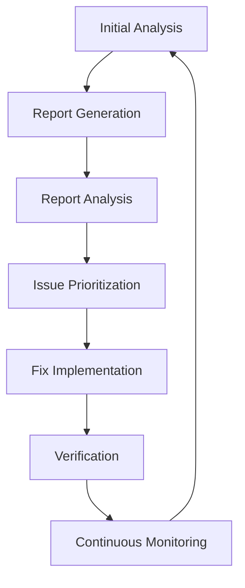

# Comprehensive Code Quality Workflow

This guide describes the complete workflow from initial analysis to automated fixes using the Claude Code Toolkit.

## Overview

The Claude Code Toolkit provides an end-to-end workflow for code quality improvement:



## Phase 1: Initial Analysis

### 1.1 Comprehensive Analysis

Start with a deep analysis of your codebase:

```bash
# Full analysis with all perspectives
/analyze-deep . --focus=all --export-all

# Targeted analysis
/analyze-deep src/ --focus=security --export-json
/analyze-deep . --focus=performance --export-md
```

### 1.2 Specialized Scans

For specific concerns, use targeted commands:

```bash
# Security audit
/security-audit . --export-all

# Performance analysis
/performance-scan . --export-json

# Test coverage analysis
/test-coverage . --export-md

# Architecture review
/analyze-parallel . --export-all
```

### 1.3 Multi-Project Analysis

For monorepos or multi-project setups:

```bash
# Analyze multiple projects
/analyze-deep frontend/ --export-json=frontend-report.json
/analyze-deep backend/ --export-json=backend-report.json
/analyze-deep mobile/ --export-json=mobile-report.json

# Cross-project analysis
/analyze-report frontend-report.json backend-report.json mobile-report.json --export-md=cross-project.md
```

## Phase 2: Report Analysis & Prioritization

### 2.1 Intelligent Report Analysis

Analyze generated reports to identify priorities:

```bash
# Basic analysis
/analyze-report latest-report.json

# Focus on quick wins
/analyze-report latest-report.json --quick-wins

# Compare with baseline
/analyze-report current.json --compare=baseline.json

# Historical trend analysis
/analyze-report --history --trends
```

### 2.2 ROI-Based Prioritization

The report analyzer calculates ROI scores:

```
ROI = (Impact × 10) / Effort_Hours

Where:
- Impact = Severity × Scope × Business_Value
- Effort_Hours = Estimated fix time
```

### 2.3 Sprint Planning

Generate actionable sprint items:

```bash
# Generate sprint backlog
/analyze-report report.json --sprint-planning --export-json=sprint-backlog.json

# Quick wins for current sprint
/analyze-report report.json --quick-wins --max-effort=4h --export-md=quick-wins.md

# Technical debt items
/analyze-report report.json --tech-debt --export-md=tech-debt.md
```

## Phase 3: Automated Fix Implementation

### 3.1 Quick Win Fixes

Start with high-ROI, low-effort fixes:

```bash
# Fix all quick wins (< 4 hours, high impact)
/fix-quick-wins report.json --dry-run  # Preview changes
/fix-quick-wins report.json --apply    # Apply fixes

# Fix specific categories
/fix-quick-wins report.json --category=security --apply
/fix-quick-wins report.json --category=performance --apply
```

### 3.2 Specialized Fix Commands

Use targeted fix commands for specific issues:

```bash
# Fix code duplication
/fix-duplicates report.json --threshold=80 --apply

# Add missing tests
/generate-tests report.json --coverage-target=80

# Fix security vulnerabilities
/fix-security report.json --severity=high,critical

# Performance optimizations
/optimize-performance report.json --focus=database,rendering
```

### 3.3 Refactoring Workflows

For larger refactoring tasks:

```bash
# Analyze refactoring impact
/refactor-impact src/legacy-module --export-md=impact.md

# Plan refactoring steps
/plan-refactoring src/legacy-module --strategy=incremental

# Execute refactoring
/execute-refactoring refactor-plan.json --step=1
/execute-refactoring refactor-plan.json --step=2
```

## Phase 4: Verification & Validation

### 4.1 Automated Verification

After fixes are applied:

```bash
# Re-run analysis
/analyze-deep . --export-json=post-fix-report.json

# Compare before/after
/analyze-report post-fix-report.json --compare=pre-fix-report.json

# Verify specific fixes
/verify-fixes fix-log.json --run-tests --check-coverage
```

### 4.2 Test Suite Validation

Ensure fixes don't break existing functionality:

```bash
# Run test suite
npm test

# Check coverage improvements
/test-coverage . --compare=baseline

# Validate performance
/performance-scan . --compare=baseline
```

## Phase 5: Continuous Monitoring

### 5.1 CI/CD Integration

Add to your CI pipeline:

```yaml
# .github/workflows/code-quality.yml
name: Code Quality Check

on: [push, pull_request]

jobs:
  quality-check:
    runs-on: ubuntu-latest
    steps:
      - uses: actions/checkout@v2
      
      - name: Run Analysis
        run: |
          /analyze-deep . --export-json=report.json
          
      - name: Check Regression
        run: |
          /analyze-report report.json --compare=baseline.json --fail-on-regression
          
      - name: Fix Quick Wins
        if: github.event_name == 'push'
        run: |
          /fix-quick-wins report.json --auto-commit
```

### 5.2 Scheduled Analysis

Set up regular quality checks:

```bash
# Daily quick scan
0 9 * * * /analyze-deep . --quick --export-json=daily-$(date +%Y%m%d).json

# Weekly comprehensive analysis
0 2 * * 0 /analyze-deep . --comprehensive --export-all

# Monthly trend report
0 3 1 * * /analyze-report --history --trends --export-md=monthly-trends.md
```

## Advanced Workflows

### Workflow 1: Zero-to-Hero Quality Improvement

For projects with poor code quality:

```bash
# 1. Baseline assessment
/analyze-deep . --comprehensive --export-all --output-dir=baseline/

# 2. Create improvement plan
/analyze-report baseline/report.json --generate-plan --weeks=12

# 3. Week 1: Critical fixes
/fix-quick-wins baseline/report.json --severity=critical --apply
/fix-security baseline/report.json --severity=critical --apply

# 4. Week 2-4: High-impact improvements
/fix-quick-wins baseline/report.json --roi-threshold=8 --apply
/generate-tests baseline/report.json --uncovered-only

# 5. Week 5-8: Architecture improvements
/refactor-impact . --identify-candidates
/plan-refactoring top-candidates.json --strategy=incremental

# 6. Week 9-12: Optimization and polish
/optimize-performance . --auto-fix
/fix-duplicates . --apply
```

### Workflow 2: Maintaining High Quality

For projects with good code quality:

```bash
# 1. Continuous monitoring
/analyze-deep . --quick --export-json=monitor.json

# 2. Regression prevention
/analyze-report monitor.json --compare=last-week.json --alert-on-regression

# 3. Incremental improvements
/analyze-report monitor.json --quick-wins --max-effort=2h
/fix-quick-wins monitor.json --auto-apply --auto-commit

# 4. Architecture evolution
/analyze-parallel . --focus=architecture --export-md=architecture-review.md
```

### Workflow 3: Team Collaboration

For team-based development:

```bash
# 1. Team dashboard generation
/analyze-deep . --export-html=dashboard.html
/analyze-report report.json --team-view --export-html=team-dashboard.html

# 2. Assignment generation
/analyze-report report.json --generate-assignments --team-size=5

# 3. Progress tracking
/analyze-report --history --by-assignee --export-md=team-progress.md

# 4. Code review assistance
/analyze-deep feature-branch/ --compare=main --export-md=review-notes.md
```

## Best Practices

### 1. Start Small
- Begin with quick wins to build momentum
- Focus on one area at a time (security, performance, etc.)
- Celebrate improvements to maintain team motivation

### 2. Automate Gradually
- Start with dry-run mode for all fixes
- Review and approve changes before applying
- Gradually increase automation as confidence grows

### 3. Track Progress
- Maintain baseline reports for comparison
- Use historical tracking for trend analysis
- Set realistic improvement targets

### 4. Integrate with Existing Tools
- Connect to issue tracking systems
- Integrate with CI/CD pipelines
- Link to code review processes

### 5. Customize for Your Needs
- Adjust ROI thresholds based on team capacity
- Configure severity levels for your context
- Create custom workflows for your process

## Command Reference

### Analysis Commands
- `/analyze-deep` - Comprehensive multi-perspective analysis
- `/security-audit` - Focused security analysis
- `/performance-scan` - Performance bottleneck detection
- `/test-coverage` - Test coverage analysis
- `/analyze-parallel` - Parallel multi-agent analysis

### Report Commands
- `/analyze-report` - Intelligent report analysis
- `/trend-analyzer` - Historical trend analysis

### Fix Commands (Planned)
- `/fix-quick-wins` - Apply high-ROI fixes
- `/fix-duplicates` - Remove code duplication
- `/fix-security` - Fix security vulnerabilities
- `/generate-tests` - Generate missing tests
- `/optimize-performance` - Apply performance optimizations

### Workflow Commands (Planned)
- `/plan-sprint` - Generate sprint plan from reports
- `/track-progress` - Monitor improvement progress
- `/generate-dashboard` - Create status dashboards

## Troubleshooting

### Common Issues

1. **Analysis takes too long**
   - Use `--quick` mode for faster results
   - Focus on specific directories
   - Run analyses in parallel

2. **Too many issues reported**
   - Use ROI-based prioritization
   - Focus on quick wins first
   - Set realistic sprint goals

3. **Fixes cause test failures**
   - Always use dry-run mode first
   - Run tests before applying fixes
   - Use incremental fix approach

4. **Team resistance to automation**
   - Start with analysis only
   - Show ROI calculations
   - Let team choose what to automate

## Future Enhancements

The workflow will continue to evolve with:

1. **AI-Powered Fix Generation**
   - Smarter fix suggestions
   - Context-aware refactoring
   - Learning from past fixes

2. **Advanced Metrics**
   - Productivity impact measurement
   - Technical debt quantification
   - Quality prediction models

3. **Integration Ecosystem**
   - More CI/CD platform support
   - Issue tracker integrations
   - IDE plugin development

4. **Collaborative Features**
   - Real-time quality dashboards
   - Team performance analytics
   - Automated PR suggestions

This comprehensive workflow transforms code quality from a manual, reactive process to an automated, proactive practice that continuously improves your codebase.